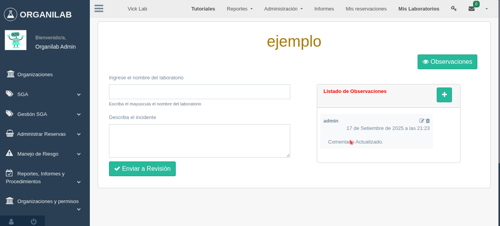

Plantillas para informes
****************************

Administración de platillas para informes
===============================================

Cuando hablamos de plantillas de informes se trata de la creación de formularios que se utilizará para la generación
de informes  de la organización.

Este módulo usa como base la funcionalidad de arrastre de elementos para la generación de formularios,
que esta potenciada por la librería **Formio.js**.

Además para tener acceso se debe ingresar previamente al módulo **Mis Laboratorios**, para que aparezca la opción
**Reportes, Informes y Procedimientos** donde se muestra la opción **Plantilla de informes**.

Ejemplo de ingreso al módulo de plantillas de informes:

Permisos Requeridos:

*   *view_organizationstructure*: Permite visualizar las organizaciones.
*   *view_laboratory*: Permite visualizar los laboratorios.
*   *add_customform*: Permite crear plantillas de informes.
*   *change_customform*: Permite modificar la plantilla de informes.
*   *delete_customform*: Permite eliminar la plantilla de informes.
*   view_customform*: Permite visualizar las plantillas.

Crear plantilla de informes
-------------------------------

La creación de plantillas de procedimientos requiere inicialmente el **nombre** y luego redireccionará a la vista de edición
para la gestión de campos requeridos en esta plantilla.

Ejemplo de creación de plantilla de informe:

Permisos Requeridos:

*   *add_customform*: Permite crear plantillas de informes.
*   view_customform*: Permite visualizar las plantillas.

Renombrar nombre de plantilla de informes
--------------------------------------------

Es posible renombrar el título de las plantillas de informes de la siguiente forma:

Permisos requeridos:
*   *change_customform*: Permite modificar la plantilla de informes.
*   view_customform*: Permite visualizar las plantillas.

Eliminar plantilla de informes
---------------------------------

El eliminar una plantilla de informe es posible, solo que se debe tener en cuenta que al momento de remover esta los
informes que se encuentren vinculados también serán eliminados del sistema.

Ejemplo de eliminación de plantillas de informes:

Permisos Requeridos:

*   *change_customform*: Permite modificar la plantilla de informes.
*   view_customform*: Permite visualizar las plantillas.

Manejo de componentes de plantillas de informes
----------------------------------------------------

El módulo de generación de plantillas posee una serie de campos que, mediante el arrastre de estos, pueden termina
produciendo formularios similares que un Google Forms.

Para comprender como funciona el sistema de arrastre primero se ve en el costado derecho del mundo tres opciones que son:

*   **Basic**: En este sitio se almacenan los campos básicos de un formulario lo cuales son:

    *   **TextField**: Este campo se utiliza para el ingreso de texto corto.

        .. image:: ../_static/gif/edit_textfield_inform_template.gif
           :height: 380
           :width: 720

        Otra funcionalidad que posee este campo es la de convertirse en un campo de fecha de la siguiente forma:

        .. image:: ../_static/gif/add_calendar_inform_template.gif
           :height: 380
           :width: 720

    *   **TextArea**: Este campo se utiliza para el ingreso texto extenso se recomiendo para campos descriptivos.

        .. image:: ../_static/gif/edit_textfield_inform_template.gif
           :height: 380
           :width: 720

    *   **Number**: Este campo se permitirá el ingreso valores numéricos.

        .. image:: ../_static/gif/number_input_inform_template.gif
           :height: 380
           :width: 720

    *   **Checkbox**: Este campo trabajará como un check y solo permite una opción.

        .. image:: ../_static/gif/checkbox_input_inform_template.gif
           :height: 380
           :width: 720

    *   **Select Boxes**: Este campo es similar al de **Checkbox** la única diferencia entre estos es que permite agregar y
        seleccionar mas de una opción.

        .. image:: ../_static/gif/select_box_inform_template.gif
           :height: 380
           :width: 720

    *   **Radio**: Este campo se es similar al **Checkbox** la unica diferecia es que permite agregar mas de una opción y a
        diferencia del **Select Boxes**, solo permite una selección.

        .. image:: ../_static/gif/number_input_inform_template.gif
           :height: 380
           :width: 720

    *   **Select**: Este campo se utilizá, para el despliegue de un lista de opciones permite la selección de uno o mas
        elementos, pero por defecto permite solo una selección.

        .. image:: ../_static/gif/select_input_inform_template.gif
           :height: 380
           :width: 720

*   **API Fields**: A diferencia que en el **Basic** este solo almacenara campos que estan configurados por *SOLVO*:

    *   **Select using APIs**: : Este campo se utiliza para el despliegue de un lista de ya generada por Solvo que son:

        *   *Informes*: Al seleccionar esta opción como base, el campo desplegara una lista de informes creados por el
            usuario, en la organización actual no de organizaciones hijas o padres que el este asociado.
        *   *Reporte de incidentes*: Al seleccionar esta opción como base, el campo desplegara una lista de incidentes,
            producidos por el usuario en la organización.

            .. note::
                Estos incidentos se generan el módulo zonas de riesgos.

        *   *Laboratorio por usuario*: Al seleccionar esta opción como base, el campo desplegara una lista de
            laboratorios a los que esta vinculado el usuario en todas las organizaciones que este asociado.
        *   *Laboratorio por organización*: Al seleccionar esta opción como base, el campo desplegara una todos los
            laboratorios asociados a la organización que este actualmente accediendo.
        *   *Usuarios en un Laboratorio/Organización*: Este opción desplegara un listado de usuarios vinculados a la
            organización y laboratorio.
        *   *Objetos*: Al seleccionar esta opción como base, se desplegarán un lista con todos los objetos registrados
            por parte de la organización que esta accediendo esto excluye organizaciones padres e hijas.

        .. image:: ../_static/gif/select_api_inform_template.gif
           :height: 380
           :width: 720

*   **Layout**: Este sitio de ingreso de columnas, tablas, pestañas para una mejor confeccion del plantilla.

En la creación campos hay que tener en cuenta que estos campos se le pueden modificar los atributos como son el:

*   **Display**: En este sitio se configura la forma que se visualiza el campo y estos son sus atributos:

        *   **Label**: Este campo permite renombre la etiqueta por defecto viene con el nombre del campo.
        *   **Placeholder**: Este campo se utiliza para dar un mensaje o ejemplo del dato a ingresar por ejemplo: "Ingrese su
            nombre", este atributo se encuentra en todos los campos.
        *   **Widget**: Este campo modifca la forma que se ven los campos por ejemplo en el **TextField** si se cambia su
            widget de InputField a Calendar Picker este se transforma en un campo de fecha, de igual forma con el Checkbox
            se puede cambiar a radio.
        *   **Label position**: Este campo modifica la posicion del Label(nombre del campo).
        *   **Description**: Este campo permite el ingreso de un texto descriptivo debajo del campo generado.
        *   **Tooltip**: Este campo permite ingresar un texto de ayuda que se hace visible a la par del **Label** un icono de
            pregunta.

*   **Data**: Este sitio la funcionalidade internas de los campos y sus atributos son:

        *   **Default Value**: Este campo se utiliza para seleccionar cual es el dato de defecto.
        *   **Required**: Este campo hace que sea obligatorio ingresar o seleccionar una opción en los campos.
        *   **Multiple Values**: Este campo permite la selección de varias opciones esta opción se presenta en los
            campos **Select Boxes**, **Select**, **Select using APIs**, **TextField**.
        *   **Test Case**: Este campo valida el formato de texto que se debe ingresar, a su vez existe 3 tipos:
            *   **Mixed**: Esta opcíon solo permite de ingreso de texto que contenga mayúscula y minúscula a la misma vez.
            *   **Lowercase**: Esta opción solo permite el ingreso de texto en letra minúscula.
            *   **Uppercase**: Esta opción solo permite el ingreso de texto en letra mayúscula.
        *   **Decimal Places**: Este campo indica cuantos decimales se puede ingresar en un campo tipo **Number**, además
            este campo solo permite valores numéricos.
        *   **Require Decimal**: Este campo hace que sea obligatorio el ingreso de valores decimales.
        *   **Values**: Este campo permite el ingreso de mas opciones en los campos **Select Boxes** y **Radio**.
        *   **Data Source Values**: Este campo permite el ingreso de mas opciones en los campo **Select**.
        *   **API**: Este campo lista una opciones predefinidas por la compañía, esta opción solo esta válida en el campo
            **Select using APIs**.
        *   **Identificador del laboratorio: Este campo solo se muestra cuando en un **Select using APIs**, se selecciona
            la opción **Usuarios en un Laboratorio/Organización**.

*   **Validation**: Este sitio como dice validara los limites que tendran los campos y sus atributos son:

        *   **Maximun Length**: Este campo limita la cantidad maxima de letras que se puede permitir en el campo vinculado.
        *   **Minimum Length**: Este campo limita la cantidad minima de letras que se puede permitir en el campo vinculado.
        *   **Minimum Word Length**: Este campo limita la cantidad maxima de palabras que se puede permitir en el campo
            vinculado.
        *   **Maximum Word Length**: Este campo limita la cantidad minima de palabras que se puede permitir en el campo
            vinculado.
        *   **Minimum Value**: Este campo establece el valor minimo que se puede ingresar en campo tipo **Number**, por
            ejemplo: 4 el numero que se puede ingresa no puede ser menor que 4 en campo.
        *   **Maximum Value**: Este campo establece el valor maximo que se puede ingresar en campo tipo **Number**  por
            ejemplo: 4 el numero que se puede ingresa no puede ser mayor que 4 en campo.
        *   **Minimum checked number**: Este campo limita la cantidad mínima de opciones que se puedan seleccionar en un
            campo tipo **Select Boxes**.
        *   **Maximum checked number**: Este campo limita la cantidad máxima de opciones que se puedan seleccionar en un
            campo tipo **Select Boxes**.

Permisos Requeridos:

*   *change_customform*: Permite modificar la plantilla de informes.
*   view_customform*: Permite visualizar las plantillas.

Visualizar Plantillas de informes
--------------------------------------

Las plantillas de informes se pueden visualizar de la siguiente manera:

..  note::
        Los campos de tipo **Select using APIs**, no pueden apreciar en la previsualización de la plantillas.

Permisos Requeridos:

*   view_customform*: Permite visualizar las plantillas.

Administración de informes
==================================

Este módulo se encarga del manejo de informes de los laboratorios que son alimentados por **Plantillas de informes** de
la organización.

.. image:: ../_static/view_informs.png
    :height: 380
    :width: 720

..  warning::
        Hay que tener en cuenta que si una **Plantilla de informe**, que se este utilizando en un informe es eliminada,
        también los informes vinculados a este serán removidos del sistema.

Ejemplo de ingreso a módulo de informes:

Permisos requeridos dentro del módulo:

*   *view_inform*: Permite visualizar los informes.
*   *add_inform*: Permite crear informes.
*   *change_inform*: Permite ingresar al informe.
*   *can_manage_inform_status*: Permite modificar el estado de los informes.
*   *delete_inform*: Permite eliminar informes.
*   *view_observation*: Permite visualizar las observaciones del informe.
*   *change_observation*: Permite editar la observación.
*   *delete_observation*: Permite eliminar las observación.

Crear informes
-------------------

En la creación de un informe este por defecto su estado se encontrará en *borrador*, así mismo se requerirá el ingreso
de los siguientes datos:

*   **Nombre**: Es un campo obligatorio.
*   **Platilla de informe**: Este campo listará las platillas asociadas a la organización, es obligatorio la selección de
    de una opción.

Ejemplo de creación de informe:

Permisos requeridos:

*   *view_inform*: Permite visualizar los informes.
*   *add_inform*: Permite crear informes.

Cambiar estado informes
---------------------------

Los informes se manejan en 3 estados: **Borrador**, **En Revisión**, **Finalizado** y la persona que puede cambiar el
estado del informe de Revisión a Finalizado o de Finalizado a Borrador, es la que posea el permiso *can_manage_inform_status*,
por lo tanto el cambio de estado se realiza de las siguientes formas:

*   **Borrador a Revisión**:
        .. image:: ../_static/gif/review_inform.gif
            :height: 380
            :width: 720

*   **Revisión a Finalizado**:
        .. image:: ../_static/gif/finalize_inform.gif
            :height: 380
            :width: 720

Permisos requeridos:

*   *view_inform*: Permite visualizar los informes.
*   *change_inform*: Permite ingresar al informe.
*   *can_manage_inform_status*: Permite modificar el estado de los informes.

Agregar Observación en informes
-------------------------------------

La creación de una observación la puede realizar cualquier usuario vinculado al laboratorio y puede ingresarla de la siguiente forma:

Permisos requeridos
*   *view_inform*: Permite visualizar los informes.
*   *add_comment*: Permite crear informes.
*   *change_inform*: Permite ingresar al informe.

Editar Observación en informes
------------------------------------

La modificación de una observación solo se le permitirá al creador de esta de la siguiente forma:

..  note::
        La descripción de la obsevación no puede esta vacío es obligatoria el ingresa de de texto.

Permisos requeridos:

*   *view_inform*: Permite visualizar los informes.
*   *change_inform*: Permite ingresar al informe.
*   *view_comment*: Permite visualizar las observaciones del informe.
*   *change_comment*: Permite editar la observación.

Eliminar Observación en informes
------------------------------------

La eliminación de una observación solo se le permitirá al creador de esta de la siguiente forma:

Permisos requeridos:

*   *view_inform*: Permite visualizar los informes.
*   *change_inform*: Permite ingresar al informe.
*   *view_comment*: Permite visualizar las observaciones del informe.
*   *remove_comment*: Permite eliminar las observación.

Eliminar informes
--------------------

..  caution::
        Hay que tener encuenta a la hora de eliminar un informe este también se elimina en el historial de los informes
        programados.

Ejemplo de eliminación de informes:

Permisos requeridos

*   *view_inform*: Permite visualizar los informes.
*   *delete_inform*: Permite eliminar informes.

Programar informes
----------------------------------

