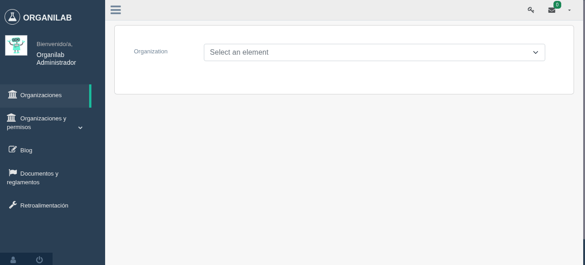
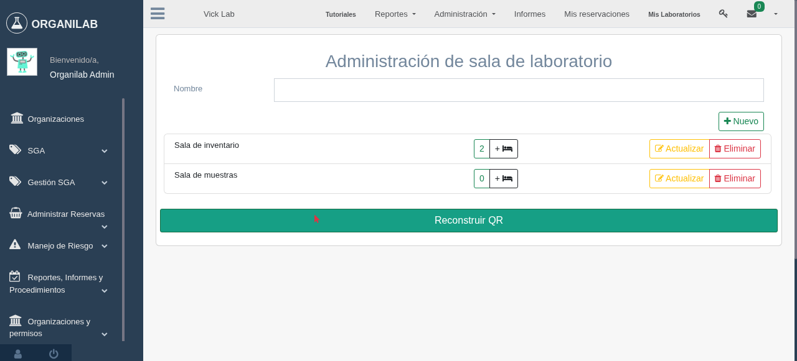
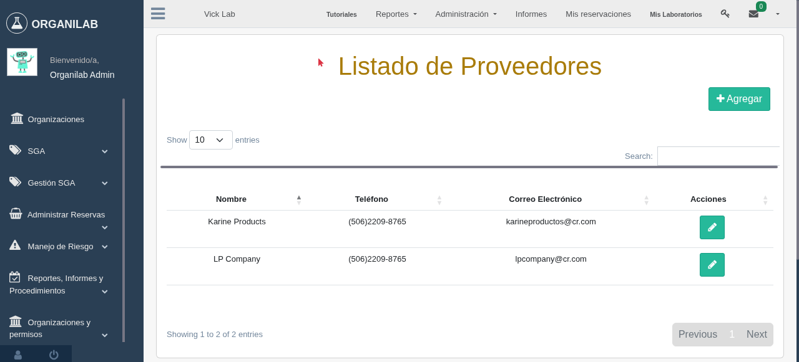
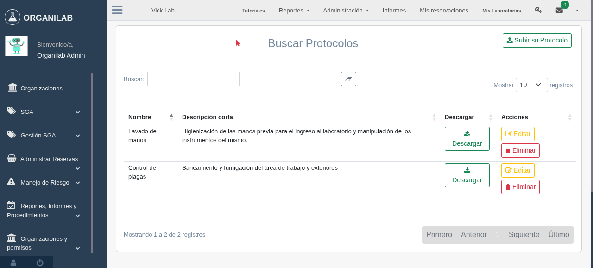
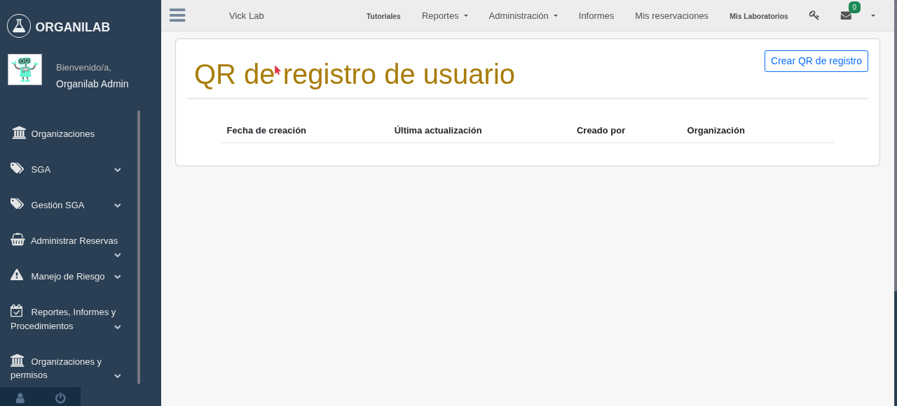
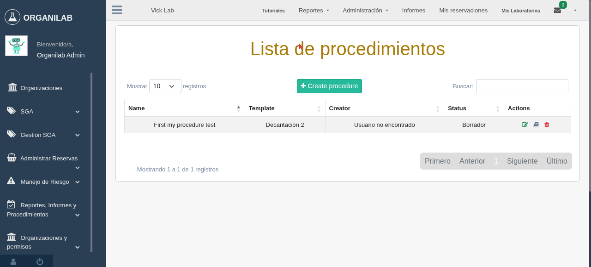
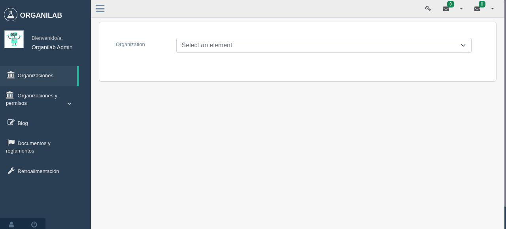

Laboratory administration
===============================

Crear un laboratorio en una organización
---------------------------------------------------

.. image:: ../_static/gif/add_laboratory_to_org.gif
   :height: 380
   :width: 720

Relacionar un laboratorio externo a una organización base
---------------------------------------------------------------

Se listarán todos los laboratorios de otras organizaciones en las cuales el usuario en sesión tenga acceso.

Relacionar un laboratorio de la organización base a una organización hija
-----------------------------------------------------------------------------------

Los laboratorios creados en la organización base podrán ser relacionados en las organizaciones hijas.

.. image:: ../_static/gif/relate_org_base_laboratory_to_org_child.gif
   :height: 380
   :width: 720

Laboratory view
**********************************

Administración de cuartos de laboratorio
-------------------------------------------
Este módulo se utiliza para el manejo de cuartos de laboratorios del laboratorio que se esté utilizando en el momento,
para acceder a este módulo existen 2 formas, en ambas se requiere el ingreso a un laboratorio, que se mostrarán en las siguientes imágenes:

En el primer caso, al ingresar al módulo de laboratorio, se debe dar click en la opción **Laboratorio**

Ejemplo de la primera forma:

.. image:: ../_static/gif/view_room.gif

En el segundo caso se puede utilizar en diferentes modulos internos del laboratorio a diferencia del anterior,
por el hecho que trabaja con la barra superior, del cual a su vez se da click en la opción **Administracion**,
el cual desplega unas nuevas opciones de acceso donde se debe seleccionar **Administración de laboratorio** para ingresar
al modúlo de cuartos de laboratorio.

Ejemplo de segundo forma:

.. image:: ../_static/gif/view_room_navbar.gif

**Permisos Requeridos:**

*   *view_laboratoryroom*: Permite visualizar los cuartos que el laboratorio posee.
*   *add_laboratoryroom*: Permite la creación de uno nuevo cuarto de laboratorio
*   *change_laboratoryroom*: Permite ingresar al módulo de actualizar cuarto y visualizar el botón de actualizar.
*   *delete_laboratoryroom*: Permite eliminar cuarto y visualizar el botón de eliminar.
*   *add_furniture*: Permite crear un mueble en el cuarto de laboratorio y que se visualize el botón de creación.
*   *view_furniture*: Permite visualizar los muebles del cuarto de laboratorio.
*   *change_furniture*: Permite ingresar al módulo de edición de mueble del cuarto y actualizarlos.

Crear sala de laboratorio
**********************************
Este módulo creara salas de labororios del laboratorio que se esta utilizando, en estos cuartos normalmente se le asocian
muebles, estantes, objetos, entre otras más.

Datos Requeridos:

*   **Nombre:** Este campo registra el nombre del sala.

Permisos requeridos:

*   *view_laboratoryroom*: Permite visualizar las salas que el laboratorio posee.
*   *add_laboratoryroom*: Permite la creación de una nueva sala de laboratorio.

Ejemplo de creación de sala de laboratorio:

.. image:: ../_static/gif/add_room.gif
   :height: 380
   :width: 720

Actualizar salas de laboratorios
***********************************
Este módulo actualizará el nombre de las salas de laboratorio.

Datos Requeridos:

*   **Nombre:** Este campo registra el nombre de la sala del laboratorio.

Permisos requeridos:

*   *view_laboratoryroom*: Permite visualizar las salas que el laboratorio posee.
*   *change_laboratoryroom*: Permite la creación de una nueva sala de laboratorio.

Ejemplo de actualización de sala de laboratorio:

Eliminar sala de laboratorio
**********************************
En este punto se permitira eliminar salas de laboratorio.

    .. note::
        Al momento de eliminar un cuarto de laboratorio, a su vez eliminara todos los muebles y estantes vinculados a esté.

Datos Requeridos:

*   Acceder a un laboratorio previamente.

Permisos requeridos:

*   *view_laboratoryroom*: Permite visualizar los cuartos que el laboratorio posee.
*   *delete_laboratoryroom*: Permite eliminar el cuarto de laboratorio elegido.

Ejemplo de eliminación de cuartos de laboratorios:

.. image:: ../_static/gif/delete_room.gif
   :height: 380
   :width: 720

Visualizar salas de laboratorio
**********************************
Este módulo permitira visualizar el listado de cuartos de laboratorio del laboratorio que este actualimente utilizando.

Datos Requeridos:

*   Acceder a un laboratorio previamente.

Permisos requeridos:

*   *view_laboratoryroom*: Permite visualizar los cuartos que el laboratorio posee.

Ejemplo de visualizar de salas de laboratorio:

.. image:: ../_static/gif/view_room.gif
   :height: 380
   :width: 720

Administración de muebles
**********************************
Cuando hablamos de muebles se trata de los que son utilizados en las salas de laboratorios, para el almacenamiento de materiales y equipos
dentro de estantes, por lo tanto estos se encuentran asociado a las salas.

Permisos Requeridos:

*   *view_laboratoryroom*: Permite visualizar los cuartos que el laboratorio posee.
*   *add_laboratoryroom*: Permite la creación de uno nuevo cuarto de laboratorio
*   *add_furniture*: Permite crear un mueble en el cuarto de laboratorio y que se visualize el botón de creación.
*   *view_furniture*: Permite visualizar los muebles del cuarto de laboratorio.
*   *change_furniture*: Permite ingresar al módulo de edición de muebles del cuarto y actualizarlos.
*   *delete_furniture*: Permite eliminar muebles del cuarto.

Creación de muebles
********************
La creación de muebles requiere de 2 los cuales son:

*   **Nombre**: Este campo es obligatorio.
*   **Tipo**: Este campo define el tipo de mueble que es por ejemplo cajón, recipiente, mueble aéreo, entre otros,
    asimismo este es un campo obligatorio.

Permisos requeridos:

*   *view_laboratoryroom*: Permite visualizar los cuartos que el laboratorio posee.
*   *add_laboratoryroom*: Permite la creación de uno nuevo cuarto de laboratorio
*   *add_furniture*: Permite crear un mueble en el cuarto de laboratorio y que se visualize el botón de creación.
*   *view_furniture*: Permite visualizar los muebles del cuarto de laboratorio.

Ejemplo de creación de muebles:

.. image:: ../_static/gif/add_furniture.gif
   :height: 380
   :width: 720

Actualización de muebles
**************************
La edición de muebles requiere de 4 los cuales son:

*   **Nombre**: Este campo es obligatorio.
*   **Tipo**: Este campo define el tipo de mueble que es por ejemplo cajon, recipiente, mueble aereo entre otros,
*   **Color**: Este campo se utiliza para dar colorear el mueble en la vista de laboratorio, este campo no es obligatorio,

Permisos requeridos:

*   *view_laboratoryroom*: Permite visualizar los cuartos que el laboratorio posee.
*   *change_furniture*: Permite editar la información referente al mueble.
*   *view_furniture*: Permite visualizar los mueble del cuarto de laboratorio.

Ejemplo de actualización de muebles:

.. image:: ../_static/gif/update_furniture.gif
   :height: 380
   :width: 720

Crear tipo de mueble
**********************************
Los muebles pueden ser de distintas formas por ejemplo estante, cajon, recipiente entre otros.

Ejemplo de creación de tipos de mueble:

Eliminación de mueble
**********************************
Para la eliminación de muebles hay que tener en cuenta diversos puntos:

*   Al eliminar un mueble, sus estantes también terminan siendo borrados del sistema.
*   También se eliminarán los objetos, materiales, equipos vinculados a los estantes del mueble.

Por lo tanto a la hora de eliminar un mueble se debe tener en cuenta los puntos anteriores.

Permisos Requeridos:

*   *view_laboratoryroom*: Permite visualizar los cuartos que el laboratorio posee.
*   *view_furniture*: Permite visualizar los mueble del cuarto de laboratorio.
*   *delete_furniture*: Permite visualizar el boton de eliminar mueble en la vista de salas de laboratorio y a su vez eliminarlo.

Ejemplo de eliminación de muebles:

Administración de estantes
**********************************
.. image:: ../_static/view_shelves.png
   :height: 380
   :width: 720

Los estantes vienen siendo los lugares donde se van almacenar los materiales, equipos y reactivos del laboratorio, a su vez
estos se encuentran asociados a un mueble.

Permisos Requeridos:

*   *view_laboratoryroom*: Permite visualizar los cuartos que el laboratorio posee.
*   *view_furniture*: Permite visualizar los mueble del cuarto de laboratorio.
*   *change_furniture*: Permite ingresar al mueble donde se desea crear los estantes.
*   *add_shelf*: Permite crear estantes.
*   *change_shelf*: Permite que aparezca el boton de actualizar estante y editar la información de este.
*   *view_shelf*: Permite visualizar los estantes.
*   *delete_furniture*: Permite visualizar el botón de eliminar estante y a su vez eliminarlo.

Como acceder a la vista:

.. image:: ../_static/gif/view_shelves.gif
   :height: 380
   :width: 720

Crear estante
**************
La creación de estantes requiere de varias datos los cuales se explicaran:

*   **Nombre**: Este campo indica el nombre del estante, a su vez este campo es obligatorio.
*   **Tipo**: Este campo define el tipo de mueble que es por ejemplo cajon, recipiente, mueble aereo entre otros,
    a su vez este campo es obligatorio.
*   **Color**: Este campo se utiliza para dar colorear el mueble en la vista de laboratorio, este campo no es obligatorio,
*   **Desecho**: La función de este campo es la marca como un estado que solo recibira materiales en estado de desecho,
    si es marcado como desecho habilitara el campo de **descripción**.
*   **Descripción**: Este campo puede ser utilizado para describir el estante de tipo desecho.
*   **Cantidad infinita**: Este campo se utiliza para indicar que el estante va recibir una cantidad infinita del material, sino se desea que sea
    **ilimitado**, se debe quitar el check del campo.
*   **Cantidad**: Este campo se utiliza para indicar la cantidad limite que el estante va a contener, ademas este campo tiene varias caracteristicas.

    *   La cantidad no puede ser menor o igual a **0**.
    *   Este campo solo aparece si se quita el check en el campo **Cantidad infinita**.
    *   Se vuelve campo obligatorio a la hora de quitar el check en el campo **Cantidad infinita**.

*   **Unidad de medida**: Este campo desplegara un listado de unidades de medida, las cuales se debe seleccionar una, en el caso que se seleccione
    la opción **-----** significa que el estante recibira materiales de cualquier tipo de unidad de medida.
*   **Limita los objetos a agregar**: Este campo su función es la habilitar el campo **Objetos habilitados cuando es limitado**.
*   **Objetos habilitados cuando es limitado**: Este campo contiene un listado de objetos que limitarán los materiales que se puedan registrar en el estante,
    además permite el ingreso de más de un objeto.

Permisos Requeridos:

*   *view_laboratoryroom*: Permite visualizar los cuartos que el laboratorio posee.
*   *view_furniture*: Permite visualizar los mueble del cuarto de laboratorio.
*   *change_furniture*: Permite ingresar al mueble que contiene los estantes.
*   *view_shelf*: Permite visualizar los estante.
*   *add_shelf*: Permite crear estantes.

Ejemplo de creación de muebles:

.. image:: ../_static/gif/add_shelf.gif
   :height: 380
   :width: 720

Actualizar estante
********************
La edición de estantes permitira modificar los valores mencionados en el punto de **Crear estante**, pero a diferencia
de la ultima funcionalidad mencionada es que limita modificación de diversos datos los cuales son:

*   **Cantidad**: Este campo tiene diversas validaciones las cuales son:

    *   Nueva cantidad no puede ser inferior a la que ha sido utilizada en el caso que existan materiales dentro del estante.
    *   La cantidad no puede ser menor o igual **0**.
    *   Se vuelve campo obligatorio a la hora de quitar el check en el campo **Cantidad infinita**.
*   **Descripción**: Este campo solo se podra modificar si se marca como desecho el estante.
*   **Unidad de medida**: La unidad de medida no puede ser cambiada si hay materiales ingresados, solo se permite cambiar
    a la opción **-------**.
*   **Objetos habilitados cuando es limitado**: No permitirá agregar nuevos materiales ni eliminar si existen estos dentro del estante.

Permisos Requeridos:

*   *view_laboratoryroom*: Permite visualizar los cuartos que el laboratorio posee.
*   *view_furniture*: Permite visualizar los mueble del cuarto de laboratorio.
*   *change_furniture*: Permite visualizar el boton de **Editar** mueble en la vista de salas de laboratorio y a su vez modificarlo.
*   *view_shelf*: Permite visualizar los estantes.
*   *add_shelf*: Permite visualizar el boton de crear estante y a su vez crearlo.

Ejemplo de actualización de estantes:

Eliminar estante
*****************
Para la eliminación de muebles hay que tener en cuenta diversos puntos:

*   Al eliminar un mueble, sus estantes también terminan siendo borrados del sistema.
*   También se eliminarán los objetos, materiales, equipos vinculados a los estantes del mueble.

Por lo tanto, a la hora de eliminar un mueble se debe tener en cuenta los puntos anteriores.

Permisos Requeridos:

*   *view_laboratoryroom*: Permite visualizar los cuartos que el laboratorio posee.
*   *view_furniture*: Permite visualizar los muebles del cuarto de laboratorio.
*   *change_furniture*: Permite ingresar al mueble.
*   *view_shelf*: Permite visualizar los estantes.
*   *delete_shelf*: Permite visualizar el botón de eliminar en los estantes y eliminarlos.

Ejemplo de eliminación de estantes:

.. warning::
    A la hora de eliminar un estante hay que tener en cuenta que también los materiales vinculados a este estante,
    por consiguiente los registros de estos materiales también se eliminarán.

Manejo de filas y columnas de estantes
****************************************
Unas de las funcionalidades que trae consigo el manejo de estantes son las filas y columnas que se utilizan para,
simular el sitio que se ubican los estantes en los muebles, por lo tanto, esta función permite la creación y eliminación
de filas y columnas, luego de efectuar las acciones deseadas, se debe dar click en el botón de Guardar si no los cambios
no se mostrarán.

Otro detalle es que a la hora de eliminar una fila con estantes mostrará un listado de estos y los materiales que posee,
en una ventana emergente como se muestra en la siguiente imagen.

.. image:: ../_static/remove_shelf_row.png
   :height: 380
   :width: 720

Permisos Requeridos:

*   *view_laboratoryroom*: Permite visualizar los cuartos que el laboratorio posee.
*   *view_furniture*: Permite visualizar los muebles del cuarto de laboratorio.
*   *change_furniture*: Permite ingresar al mueble.
*   *view_shelf*: Permite visualizar los estantes.
*   *delete_shelf*: Permite eliminar los estantes.

Ejemplo de manejo filas y columnas:

.. image:: ../_static/gif/manage_rows_cols.gif
   :height: 380
   :width: 720

Ejemplo de eliminación de filas y columnas con estantes:

Reconstrucción de QR
**********************************

El sistema posee una función para la generación de imágenes QR. esto se utilizarán para facilitar la búsqueda de salas, muebles y estantes del
laboratorio. Sobre la reconstrucción de QR se busca actualizar los las imágenes para los siguientes casos:

*   Cuando se traslada el laboratorio a otra organización.
*   Cambio del dominio donde se hospede la aplicación.

Ejemplo de activación de accion:

Administración de objetos
-------------------------------------------
Unos de los módulos más importantes es el de objetos que permitirá la creación, edición y eliminación de estos, los cuales
se dividen en tres tipos:

*   **Reactivos**.
*   **Materiales**.
*   **Equipos**

También los objetos creados solo se podrán utilizar en los laboratorios vinculados a las organizaciones padres e hijas, por lo
tanto, se debe tener en cuenta a la hora de eliminar o actualiza algún objeto, afecta de forma general a todas las organizaciones,
que se encuentra vinculadas.

Por otro lado, los objetos también se requiere en el módulo de objetos de estantería que utiliza como base los objetos, a su
en la generación de reservas se dan uso, por lo tanto, tener extremo cuidado en la manipulación de estos

Permisos requeridos:

*   *view_laboratory*: Permite ingresar al laboratorio.
*   *view_object*: Permite visualizar los objetos en el módulo de administrativo de objetos.
*   *add_object*: Permite visualizar los botones para el ingreso a los módulos de reactivos, materiales y equipos,
    además, la creación de objetos.
*   *change_object*: Permite visualizar el botón de **editar** en los objetos reactivos, materiales y equipos,
    además, su actualización.
*   *delete_object*: Permite visualizar el botón de **eliminar** en los objetos reactivos, materiales y equipos,
    además, su eliminación.

    .. note::
        Existen 2 formas para ingresar a los módulos de objetos reactivos, materiales y equipos, los cuales se van a
        explicar en los siguientes puntos.

Administración de Reactivos
*****************************
Los objetos de tipos reactivos vienen siendo químicos como hidróxido, sulfuro entre otros, existen dos formas para
ingresar a este módulo.

La primera forma:

.. image:: ../_static/gif/view_reactives.gif
   :height: 380
   :width: 720

La segunda forma:

.. note::
    La tabla donde se listan los reactivos se puede ver en la primera columna una simbología:

    * **Forma de casita**: Significa el reactivo es público y que cualquier usuario de la organización puede utilizarlo.
    * **Forma de X amarilla**: Significa que el reactivo no es precursor.
    * **Forma de check verde**: Significa que el reactivo es precursor.
    * **Forma de envase**: Significa que el reactivo es bioacumulable.

Crear Reactivos
*****************
En la creación de reactivos se requerirá el ingreso de varios datos, los cuales son:

*   **Código**: Este campo se utiliza para ingresar el código de barra o identificación del equipo,
    este campo es obligatorio ingresar.
*   **Nombre**: Este campo es obligatorio de ingresar.
*   **Sinónimo**: Este campo se utiliza para el ingreso de alias o sinónimos del equipo, este campo no es
    obligatorio de ingresar.
*   **Compartir con otros**: Este campo se utiliza para indicar si el equipo puede ser manipulado por otros si se marca
    como **No**, este no será visualizado por otros usuarios.
*   **Descripción**: Este campo se utiliza para dar una descripción básica del equipo, esta información no es obligatoria de ingresar.
*   **Características de objeto**: Este campo indica las características del objeto, las cuales se pueden seleccionar varias,
    además, este campo es obligatoria seleccionar una y si no existe ninguna visitar el módulo de **Características de objetos**,
    para la creación de estas.
*   **Modelo**: Este campo registrará el modelo del equipo, este campo es obligatorio ingresar información.
*   **Serie**: Este campo no es obligatorio de ingresar información.
*   **Placa**: Este campo no es obligatorio de ingresar información
*   **Iarc**: Este campo se utiliza para indicar, grupo carcinógeno que afecte a los usuarios y no es obligatorio
    seleccionar el dato.
*   **Imdg**:  Este campo se utiliza para indicar, el tipo de contaminación del reactivo y, no es obligatorio seleccionar
    el dato.
*   **Órgano blanco**: Este campo indica que sectores del cuerpo humano afecta el reactivo, por consiguiente permite él
    ingreso de más de una opción.
*   **Bioaccumulable**: Este campo indica si el reactivo es Bioaccumulable.
*   **Fórmula molecular**: Este campo no es obligatorio de ingresar.
*   **Número ID CAS**: Este campo se utiliza para agregar el número CAS del reactivo y no es obligatorio es ingresar el dato
*   **Hoja de seguridad**: Este campo se utiliza para ingresar el documento de la hoja de seguridad, este puede ser en
    cualquier formato y no es obligatorio agregar el documento.
*   **Es precursor**: Este campo indica si es precursor el reactivo.
*   **Tipo precursor**: Este campo se utiliza para indicar el tipo de precursor que es el reactivo, y no es obligatorio
    seleccionar alguna opción.
*   **Indicación de peligro**: Este campo se utiliza para agregar las indicaciones de peligro  que forman parte de la
    norma **SGA**, se pueden seleccionar varias opciones, a su vez no es obligatorio seleccionar alguna opción.
*   **Códigos UE**:Este campo se utiliza para agregar las indicaciones de peligro  que no forman parte de la
    norma **SGA**, se pueden seleccionar varias opciones, a su no es obligatorio seleccionar alguna opción.
*   **Códigos NFPA**: Este campo se utiliza para agregar códigos basados en las normas **NFPA**, no es obligatorio
    seleccionar alguna opción.
*   **Clases de almacenamientos**: Este campo se utiliza para indicar los tipos de almacenamientos para el reactivo,
    no es obligatorio seleccionar alguna opción.
*   **Seveso**: Este campo indica si el reactivo es un *Seveso en la lista lll*.
*   **Representación de la sustancia**: Este campo se utiliza para el agregar una imagen que represente al reactivo,
    en cualquier formato, no es obligatorio ingresar alguna imagen.

Permisos requeridos:

*   *view_laboratory*: Permite ingresar al laboratorio.
*   *view_object*: Permite visualizar los reactivos.
*   *add_object*: Permite visualizar los botonos para el ingreso a los módulo de reactivos, además la creación de objetos.

Ejemplo de creación de reactivo:

.. image:: ../_static/gif/add_reactive_object.gif
   :height: 380
   :width: 720

Editar Reactivos
*******************
En la edición de reactivos se podrá modificar cualquier dato del objeto, solo hay que tener en cuenta que este, cambio
influye en los estantes que posean este objeto.

Permisos requeridos:

*   *view_laboratory*: Permite ingresar al laboratorio.
*   *view_object*: Permite visualizar los reactivos.
*   *add_object*: Permite visualizar los botonos para el ingreso al módulo de reactivos.
*   *change_object*: Permite visualizar el botón de **editar** en los objetos reactivos, además su actualización.

Ejemplo de edición de reactivo:

.. image:: ../_static/gif/update_reactive_object.gif
   :height: 380
   :width: 720

Buscar Reactivos
*******************
Esta funcionalidad permite la búsqueda de reactivos por medio del código o nombre de reactivo, además no es requerido,
ingresar toda la descripción porque por cada letra que se ingresa se filtrarán los reactivos que coincidan con el dato
ingresado.

Permisos requeridos:

*   *view_laboratory*: Permite ingresar al laboratorio.
*   *view_object*: Permite visualizar los reactivos.
*   *add_object*: Permite visualizar los botonos para el ingreso a los modulos de reactivos.
*   *view_object*: Permite visualizar los reactivos.

Ejemplo de busqueda de reactivos:

.. image:: ../_static/gif/search_reactive_object.gif
   :height: 380
   :width: 720

Eliminar Reactivos
*******************

.. warning::
    A la hora de eliminar un objeto hay que tener en cuenta que también los lugares donde se utilizan este, se borrara
    su registro.

Permisos requeridos:

*   *view_laboratory*: Permite ingresar al laboratorio.
*   *view_object*: Permite visualizar los objetos en el modulo de reactivos.
*   *add_object*: Permite visualizar los botonos para el ingreso al modulo de reactivos.
*   *delete_object*: Permite visualizar el botón de **eliminar** en los reactivos.

Ejemplo de eliminación de reactivo:

.. image:: ../_static/gif/delete_reactive_object.gif
   :height: 380
   :width: 720

Administración de Materiales
**********************************

Crear Materiales
**********************************
En la creación de materiales existen dos tipos, los cuales son de normal uso y los contenedores que son utilizados para él
almacenamiento de reactivos o sustancias, asimismo se requerirá el ingreso de varios datos, los cuales son:

*   **Código**: Este campo se utiliza para ingresar el código de barra o identificación del material,
    este campo es obligatorio ingresar.
*   **Nombre**: Este campo es obligatorio de ingresar.
*   **Sinónimo**: Este campo se utiliza para el ingreso de alias o sinónimos del material, este campo no es
    obligatorio de ingresar.
*   **Compartir con otros**: Este campo se utiliza para indicar si el material puede ser manipulado por otros si se marca
    como **No**, este no va ser visualizado por otros usuarios.
*   **Descripción**: Este campo se utiliza para dar una descripción básica del material, esta información no es obligatoria de ingresar.
*   **Características de objeto**: Este campo indica las características del objeto, las cuales se pueden seleccionar varias,
    , además, este campo es obligatoria seleccionar una y si no existe ninguna visitar el módulo de **Características de objetos**,
    para la creación de estas.
*   **Es un contenedor**: Este campo se utiliza para indicar si el material es un contenedor de sustancias, si se selecciona,
    como **Sí**, habilita los campos **Capacidad** y **Unidad de medida de capacidad** y si es **No** las oculta.
*   **Capacidad**: Este campo se utiliza para indicar la capacidad que el contenedor va a poder almacenar de sustancias, este
    campo muestra y se vuelve obligatorio, solo si se marca como contenedor el material
*   **Unidad de medida de capacidad**: Este campo se utiliza para indicar la unidad de medida de los reactivos o sustancias,
    qué podre contener el material, de igual forma que el campo **Capacidad**, este se encuentra condicionado al campo
    **Es un contenedor**.

Permisos requeridos:

*   *view_laboratory*: Permite ingresar al laboratorio.
*   *view_object*: Permite visualizar los objetos en el módulo de administrativo de objetos.
*   *add_object*: Permite visualizar los botonos para el ingreso a los módulos de reactivos, materiales y equipos,
    además la creación de objetos.

Ejemplo de creación de materiales:

Ejemplo de creación de materiales de tipo contenedor:

Editar Materiales
**********************************
En la edición de materiales se podrá modificar cualquier dato del objeto, solo hay que tener en cuenta que este, cambio
influye en los estantes que posean este objeto.
Eso sí, hay que tener un especial cuidado con los siguientes campos a la hora de actualizar:

*   **Es un contenedor**: Si el material es un contenedor y desea que ya no sea, no se permitirá modificar este campo,
    si ya se ha utilizado como contenedor de varios reactivos, la única forma es eliminando estos en el módulo de estantería
    de objetos.
*   **Capacidad**: Si se vuelve contenedor el material la capacidad no puede ser menor que 0 nulo.
*   **Unidad de medida de capacidad**: Si se vuelve contenedor el material, se requiere la selección de un unidad de medida.

Permisos requeridos:

*   *view_laboratory*: Permite ingresar al laboratorio.
*   *view_object*: Permite visualizar los objetos en el módulo de administrativo de objetos.
*   *add_object*: Permite visualizar los botonos para el ingreso a los modulos de reactivos.
*   *change_object*: Permite visualizar el botón de **editar** en los objetos materiales, además su actualización.

Ejemplo de actualización de materiales:

Buscar Materiales
*******************
Esta funcionalidad permite la búsqueda de materiales por medio del código o nombre del material, además no es requerido,
ingresar toda la descripción porque por cada letra que se ingresa se filtrarán los materiales que coincidan con el dato
ingresado.

Permisos requeridos:

*   *view_laboratory*: Permite ingresar al laboratorio.
*   *add_object*: Permite el ingreso al módulo de materiales.
*   *view_object*: Permite visualizar los materiales.

Ejemplo de busquedad de materiales:

Eliminar Materiales
*********************
.. warning::
   A la hora de eliminar un objeto hay que tener en cuenta que también los lugares donde se utilizan este, se borraran
    sus registros.

Permisos requeridos:

*   *view_laboratory*: Permite ingresar al laboratorio.
*   *view_object*: Permite visualizar los objetos en el módulo de materiales.
*   *add_object*: Permite el ingreso al módulo de materiales.
*   *delete_object*: Permite visualizar el botón de **eliminar** en los materiales.

Ejemplo de eliminación de materiales:

Administración de Equipos
**********************************

Este módulo permitirá el manejo de los equipos de la organización como pueden ser balanzas, medidores, cajas, entre otros.
Actualmente, para el acceso a este módulo existen 2 formas de ingresar, las cuales se mostrarán en las siguientes imágenes:

La primera forma:

La segunda forma:

Crear Equipos
***************

En la creación de equipos se requerirá el ingreso de varios datos, los cuales son:

*   **Código**: Este campo se utiliza para ingresar el código de barra o identificación del equipo, este campo es de carácter obligatorio.
*   **Nombre**: Este campo es obligatorio de ingresar.
*   **Sinónimo**: Este campo se utiliza para el ingreso de alias o sinónimos del equipo, este campo no es obligatorio de ingresar.
*   **Compartir con otros**: Este campo se utiliza para indicar si el equipo puede ser manipulado por otros si se marca
    como **No**, este no va ser visualizado por otro usuarios.
*   **Descripción**: Este campo se utiliza para dar una descripción básica del equipo, esta información no es obligatoria de ingresar.
*   **Características del objeto**: Este campo indica las características del objeto, es requerido y de selección múltiple, sino existe ninguna opción para seleccionar entonces es necesario visitar el modúlo de **Caracteristicas de objetos**, para la creación de estas.
*   **Modelo**: Este campo registrará el modelo del equipo, este campo es de carácter obligatorio.
*   **Serie**: Este campo no es obligatorio de ingresar información.
*   **Placa**: Este campo no es obligatorio de ingresar información

Permisos requeridos:

*   *view_laboratory*: Permite al usuario ingresar al laboratorio.
*   *add_object*: Permite que el botón de agregar se habilite y el usuario en sesión pueda agregar nuevos equipos.
*   *view_object*: Permite visualizar los equipos.

Ejemplo de creación de equipos:

Editar Equipos
****************

En la edición de equipos se podrá modificar cualquier dato del objeto, solo hay que tener en cuenta que este cambio
influye en los estantes que posean este objeto.

Permisos requeridos:

*   *view_laboratory*: Permite al usuario ingresar al laboratorio.
*   *view_object*: Permite visualizar los equipos.
*   *change_object*: Permite que el botón de edición se habilite y el usuario en sesión pueda editar equipos.

Ejemplo de actualización de equipos:

.. image:: ../_static/gif/update_equipment_object.gif
   :height: 380
   :width: 720

Buscar Equipos
*****************

Esta funcionalidad permite la búsqueda de equipos por medio del código o nombre de reactivo, además no es requerido,
ingresar toda la descripción porque por cada letra que se ingresa se filtrarán los equipos que coincidan con el dato
ingresado.

Permisos requeridos:

*   *view_laboratory*: Permite ingresar al laboratorio.
*   *view_object*: Permite visualizar los equipos.

Ejemplo de búsqueda de equipos:

Eliminar Equipos
**********************************

.. warning::
   A la hora de eliminar un objeto hay que tener en cuenta que también se eliminarán todos los registros relacionados al mismo.

Permisos requeridos:

*   *view_laboratory*: Permite ingresar al laboratorio.
*   *view_object*: Permite visualizar los objetos en el módulo de equipos.
*   *delete_object*: Permite visualizar el botón de **eliminar** y le da el accesso al usuario de dicha acción.

.. image:: ../_static/gif/delete_equipment_object.gif
   :height: 380
   :width: 720

Administración de características de objetos
-----------------------------------------------
Este módulo se encarga del manejo de las características de los objetos propios de los objetos dentro de la organización.

Al igual que el módulo de **objetos,** este posee 2 formas de ingreso, las cuales son:

Primera forma:

Segunda forma:

Permisos requeridos:

*   *view_laboratory*: Permite ingresar al laboratorio.
*   *view_objectfeatures*: Permite visualizar los objetos en el modulo de administrativo de objetos.
*   *add_objectfeatures*: Permite visualizar los boton para el ingreso al modulo de caracteristicas de objetos,
    además la creación de estos.
*   *view_objectfeatures*: Permite visualizar el listado de características de objetos.
*   *change_objectfeatures*: Permite visualizar los boton de **Editar** de las  caracteristicas de objetos,
    además de la edición de estos.
*   *delete_objectfeatures*: Permite visualizar los boton de **Eliminar** de las caracteristicas de objetos,
    además de la eliminación de estos.

Crear características de objetos
**********************************
En la creación de características se requerirán solo 2 datos que son obligatorios, los cuales son:

*   **Nombre.**
*   **Descripción.**

Permisos requeridos:

*   *view_laboratory*: Permite ingresar al laboratorio.
*   *view_objectfeatures*: Permite visualizar los objetos en el modulo de administrativo de objetos.
*   *add_objectfeatures*: Permite visualizar los boton para el ingreso al modulo de caracteristicas de objetos,
    además la creación de estos.

Ejemplo de creación de caracteristica de objeto:

Actualizar características de objetos
***************************************
En la actualización de características se requerirán lo mismo campos que la creación y ninguno de estos puede ser nulo.

.. note::
    Hay que tener en mente a la hora de modificar el nombre de alguna característica esta se reflejara en los objetos
    que la eeten utilizando.

Permisos requeridos:

*   *view_laboratory*: Permite ingresar al laboratorio.
*   *view_objectfeatures*: Permite visualizar los objetos en el modulo de administrativo de objetos.
*   *add_objectfeatures*: Permite visualizar los botón para el ingreso al modulo de caracteristicas de objetos.
*   *view_objectfeatures*: Permite visualizar el listado de características de objetos.
*   *change_objectfeatures*: Permite visualizar los boton de **Editar** de las  caracteristicas de objetos, además de
    la edición de estos.

Ejemplo de actualización de caracaterística de objeto:

Eliminar características de objetos
***************************************

.. caution::
    Hay que tener en cuenta a la hora de eliminar una característica esta, también se borrara de los objetos relacionados con esta.

Permisos requeridos:

*   *view_laboratory*: Permite ingresar al laboratorio.
*   *view_objectfeatures*: Permite visualizar los objetos en el módulo de administrativo de objetos.
*   *add_objectfeatures*: Permite visualizar los boton para el ingreso al modulo de caracteristicas de objetos.
*   *view_objectfeatures*: Permite visualizar el listado de características de objetos.
*   *delete_objectfeatures*: Permite visualizar los boton de **Eliminar** de las caracteristicas de objetos,
    además de la eliminación de estos.

Ejemplo de elimnaación de caracaterística de objeto:

Administración de proveedores
-------------------------------
Este módulo se encargará de manejar los proveedores del laboratorio, no es a nivel de organización sino del laboratorio,
que se esté utilizando en el momento.

Permisos requeridos:

*   *view_laboratory*: Permite ingresar al laboratorio.
*   *view_provider*: Permite visualizar la lista de proveedores del laboratorio.
*   *add_provider*: Permite visualizar el botón para el ingreso al modulo de proveedores y creación de estos.
*   *change_provider*: Permite la edición de proveedores.

.. note::
    Actualmente, solo se pueden crear y actualizar proveedores, todavía no permite la eliminación de estos

Ejemplo de ingreso a modúlo de proveedores:

Crear Proveedor
*****************
En la creación de proveedores se requieren 4 datos, los cuales son:

*   **Nombre**: Este campo es obligatorio de ingresar.
*   **Telefóno**: Este campo se utiliza para el registro de numeros telefonicos, actualmente se tiene que agregar 9 digitos,
    por ejemplo, 506-8888-88-88 los primeros 3 digitos son el codigo de paiś, a su vez este dato no es obligatorio de ingresar.
*   **Correo Electrónico**: Es un campo no obligatorio de ingresar
*   **Cedúla Jurídica**: Este campo es obligatorio de ingresar.

Permisos requeridos:

*   *view_laboratory*: Permite ingresar al laboratorio.
*   *add_provider*: Permite visualizar el botón para el ingreso al modulo de proveedores y creación de estos.

Ejemplo de creación de proveedor:

Actualizar Proveedor
***********************
En edición de proveedores se permite modificar cualquiera de los datos indicados en el punto de **Crear Proveedor**.

Permisos requeridos:

*   *view_laboratory*: Permite ingresar al laboratorio.
*   *view_provider*: Permite visualizar la lista de proveedores del laboratorio.
*   *change_provider*: Permite la edición de proveedores.

Ejemplo de edición de proveedores:

Administración de protocolos
-------------------------------------------
Este módulo se encagara de manejar los protocolos internos de la organización por parte de la administración

Permisos requeridos:

*  *view_laboratory*: Permite el ingreso al laboratorio
*  *view_protocol*: Permite ingresa al módulo de protocolos.
*  *add_protocol*: Permite visualizar el botón de crear y a su vez los genera
*  *change_protocol*: Permite la modificación de protocolos.
*  *delete_protocol*: Permite la eliminación de protocolos.

Crear Protocolo
******************
En la creación de protocolos se requerirán 3 datos, los cuales son:

*   **Nombre**: Esta campo se ingresará el nombre del protocolo.
*   **Descripción corta**: Este campo se ingresará una descripción sobre el protocolo, tiene como un límite de 300 letras.
*   **Archivo del protocolo**: Este campo se utilizará para agregar documentos solo en formato **PDF**.

.. note::
    Para la creación de protocolos, los 3 datos anteriores es obligatorio ingresarlos para crear el protocolo.

Permisos requeridos:
*   *view_laboratory*: Permite el ingreso al laboratorio.
*   *view_protocol*: Permite ingresar al módulo de protocolos.
*   *add_protocol*: Permite visualizar el botón de crea protocolo y a su vez crearlos.

Actualizar protocolo
***********************
En la edición de protocolos se permitirá modificar cualquiera de los campos que se mencionan en el **Crear Protocolo**.

Permisos requeridos:

*  *view_laboratory*: Permite el ingreso al laboratorio
*  *view_protocol*: Permite ingresar al módulo de protocolos.
*   *add_protocol*: Permite modificar los protocolos.

Ejemplo de edición de protocolo:

Descargar protocolos
***********************
Permisos requeridos:

*  *view_laboratory*: Permite el ingreso al laboratorio
*  *view_protocol*: Permite ingresar al módulo de protocolos.

Ejemplo de edición de protocolo:

Eliminar protocolo
***********************

Permisos requeridos:

*  *view_laboratory*: Permite el ingreso al laboratorio
*  *view_protocol*: Permite ingresar al módulo de protocolos.
*  *delete_protocol*: Permite modificar los protocolos.

Ejemplo de eliminación de protocolo:

Registro de usuarios por QR
----------------------------
Este módulo se encarga de la generación de códigos QR para el registro de usuarios al laboratorio y a su vez a
la organización mediante el escaneo de la imagen.

Permisos requeridos:

*  *view_laboratory*: Permitira el ingreso al laboratorio.
*  *view_registeruserqr*: Permite ingresa al módulo de registro de usuarios, ademaá de visualizar la lista de QR.
*  *add_registeruserq*: Permite visualizar el botón de crear y a su vez los genera.
*  *change_registeruserq*: Permite la modificacion de registros.
*  *delete_registeruserq*: Permite la eliminacion de registros.

Ejemplo de ingresar al módulo:

.. image:: ../_static/gif/view_register_user_QR.gif
   :height: 380
   :width: 720

Crear QR de registro de usuarios
**********************************
En creación de los QR se requieren varios datos lo cuales son:

*   **Activar usuario**: Este campo se utiliza para indicar cuando un usuario se registra, este pueda tener acceso
    inmediato si la opción seleccionada es **Sí**, pero si es **No**, la administración se encargará de la activación
    del usuario.
*   **Rol**: Este campo listará los roles registrados en la organización, por lo tanto, a la hora de registrar él
    usuario vendrán con el rol elegido.
*   **Organización**: Este campo listará las organizaciones vinculadas a la organización excluyendo solo las que poseen
    un código QR.
*   **Código**: Este campo indica el código de acceso, el cual como máximo aceptara 4 dígitos y este debe ser único, no
    puede ser repetido.

Permisos requeridos:

*  *view_laboratory*: Permitira el ingreso al laboratorio.
*  *view_registeruserqr*: Permitira ingresa al módulo de registro de usuarios por QR.
*  *add_registeruserq*: Permitira la creación de registros.

Ejemplo de creación de QR:

Actualizar QR de registro de usuarios
***************************************
En la edición de los archivos QR no se permitira la modificacion del codigo de este pero si los demás campos.

Permisos requeridos:

*  *view_laboratory*: Permite el ingreso al laboratorio.
*  *view_registeruserqr*: Permite ingresa al módulo de registro de usuarios, ademas de visualizar la lista de QR.
*  *change_registeruserq*: Permite la modificacion de registros.

Ejemplo de edición de QR:

.. image:: ../_static/gif/update_register_user_QR.gif
   :height: 380
   :width: 720

Bitácora de registro de usuarios por QR
******************************************
Sobre la bitácora de registro de usuario listara los usuarios que se registraron al sistema mediante el uso del QR, viene
siendo similar a un historial.

*  *view_laboratory*: Permite el ingreso al laboratorio
*  *view_registeruserqr*: Permite ingresa al módulo de registro de usuarios, además de visualizar la lista de QR.

Ejemplo de ingresar a bitacoras del QR:

.. image:: ../_static/gif/logentry_register_user_QR.gif
   :height: 380
   :width: 720

Descargar QR para registro de usuarios
******************************************

Permisos requeridos:

*  *view_laboratory*: Permite el ingreso al laboratorio.
*  *view_registeruserqr*: Permite ingresa al módulo de registro de usuarios, además de visualizar la lista de QR.

Ejemplo de como descargar el archivo QR:

.. image:: ../_static/gif/download_register_user_QR.gif
   :height: 380
   :width: 720

Eliminar QR de registro de usuarios
***************************************
.. warning::
    Al eliminar un archivo QR del sistema ya este no puede ser utilizado en los lugares que se esté utilizando,
    por consiguiente sería preferible notificar a lo usuarios que va que inutilizado el QR.

Permisos requeridos:

*  *view_laboratory*: Permite el ingreso al laboratorio
*  *view_registeruserqr*: Permite ingresa al módulo de registro de usuarios, además de visualizar la lista de QR.
*  *delete_registeruserq*: Permite la eliminación de registros.

Ejemplo de eliminación de QR:

.. image:: ../_static/gif/delete_register_user_QR.gif
   :height: 380
   :width: 720

Mis procedimientos
----------------------------
Este modúlo se encargará de generar procedimientos quimicos dentro de la organización que a su vez permitirán generar
reservaciones de objetos vinculados a la plantilla de procedimiento asociada.

Permisos requeridos para manipular el modulo de forma general:

*  *view_laboratory*: Permite el ingreso al laboratorio.
*  *view_myprocedure*: Permite ingresa al módulo de mis procedimientos y visualizar los procedimientos.
*  *add_myprocedure*: Permite la creación de procedimientos.
*  *change_myprocedure*: Permite modificar el estado de los procedimientos.
*  *delete_myprocedure*: Permite eliminar procedimientos.
*  *add_commentprocedurestep*: Permite agregar observaciones de los procedimientos.
*  *view_commentprocedurestep*: Permite visualizar los comentarios de los procedimientos.
*  *change_commentprocedurestep*: Permite modificar las observaciones de los procedimientos.
*  *delete_commentprocedurestep*: Permite eliminar las observaciones de los procedimientos.
*  *view_procedurestep*: Permite visualizar los pasos de la plantilla de procedimientos en los procedimientos.

Ejemplo de ingreso a modulo de mis procedimientos

Crear procedimiento
************************

En la creación de procedimientos se requieren 2 datos en especifico:

*   *Nombre*: Es un campo obligatorio de insercción.
*   *Plantilla*: Esta plantilla esta vinculadas a las plantillas de procedimientos dentro de las organizaciones hijas y
    padres, es obligatorio la selección de una.

.. note::
        Por defecto el procedimiento se crea en estado Borrador, los procedimientos pueden estar en 3 estados que son:
        *   **Borrador**.
        *   **Revisión**.
        *   **Finalizado**.

Ejemplo de creacion de procedimiento

Editar estado de procedimiento
***************************************

En la edición de estados de procedimiento se puede pasar de Borrador a Revision, mientras que de Revisión a Finalizado como
se muestran en los siguientes ejemplos:

*   Borrador a Revision:

    .. image:: ../_static/gif/review_my_procedure.gif
       :height: 380
       :width: 720

*   Revision a Finalizado:

    .. image:: ../_static/gif/finalize_my_procedure.gif
       :height: 380
       :width: 720

Permisos Requeridos:

*  *view_laboratory*: Permite el ingreso al laboratorio.
*  *view_myprocedure*: Permite ingresa al módulo de mis procedimientos y visualizar los procedimientos.
*  *change_myprocedure*: Permite modificar el estado de los procedimientos.

Eliminar procedimientos
***************************************

Permisos requeridos:

*  *view_laboratory*: Permite el ingreso al laboratorio.
*  *view_myprocedure*: Permite ingresa al módulo de mis procedimientos y visualizar los procedimientos.
*  *delete_myprocedure*: Permite eliminar el estado de los procedimientos.

Agregar observación en procedimiento
***************************************

A los procedimientos se les puede ingresar comentarios o observaciones sobre las recetas de la siguiente forma:

Permisos requeridos:

*  *view_laboratory*: Permite el ingreso al laboratorio.
*  *view_myprocedure*: Permite ingresa al módulo de mis procedimientos y visualizar los procedimientos.
*  *change_myprocedure*: Permite ingresar al procedimiento.
*  *add_commentprocedurestep*: Permite agregar observaciones de los procedimientos.

Editar observación en procedimiento
***************************************
En la edicion de observaciones solo lo podra hacer el usuario que la creó:

Permisos requeridos:

*  *view_laboratory*: Permite el ingreso al laboratorio.
*  *view_myprocedure*: Permite ingresa al módulo de mis procedimientos y visualizar los procedimientos.
*  *change_myprocedure*: Permite ingresar al procedimiento.
*  *change_commentprocedurestep*: Permite editar observaciones de los procedimientos.

Eliminar observación en procedimiento
***************************************
En la eliminación de observaciones de igual forma que en la edición solo el usuario que la créo podra eliminarla:

Permisos requeridos:

*  *view_laboratory*: Permite el ingreso al laboratorio.
*  *view_myprocedure*: Permite ingresa al módulo de mis procedimientos y visualizar los procedimientos.
*  *change_myprocedure*: Permite ingresar al procedimiento.
*  *delete_commentprocedurestep*: Permite eliminar observaciones de los procedimientos.

Generar reservación de procedimiento
***************************************
Los procedimientos también permite generar reservaciones donde los materiales que se reservan son los objectos, de los
pasos de la plantilla de procedimientos, ademas hay que tener en cuenta que si en las estanterías de objectos no existe
un material o la cantidad de este es insuficiente a lo solicitado no se podra dar paso la reservación.

Permisos requeridos:

*  *view_laboratory*: Permite el ingreso al laboratorio.
*  *view_myprocedure*: Permite ingresa al módulo de mis procedimientos y visualizar los procedimientos.
*  *add_reservedproducts*: Permite generar reservación.
*  *add_reservation*: Permite generar visualizar las reservaciones.
