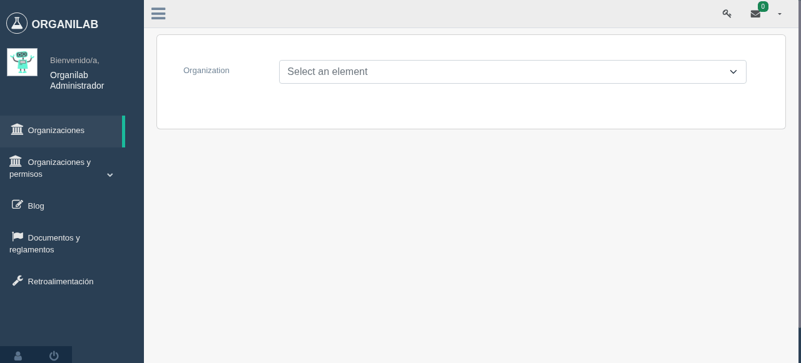
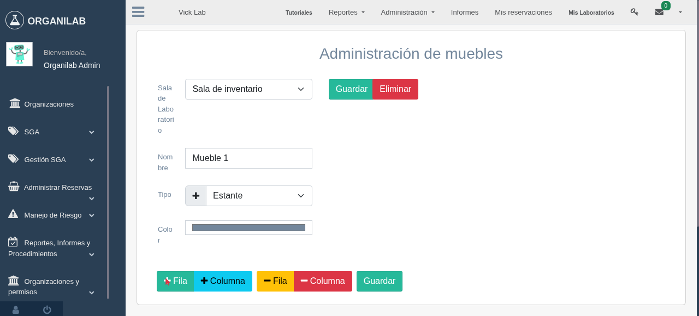
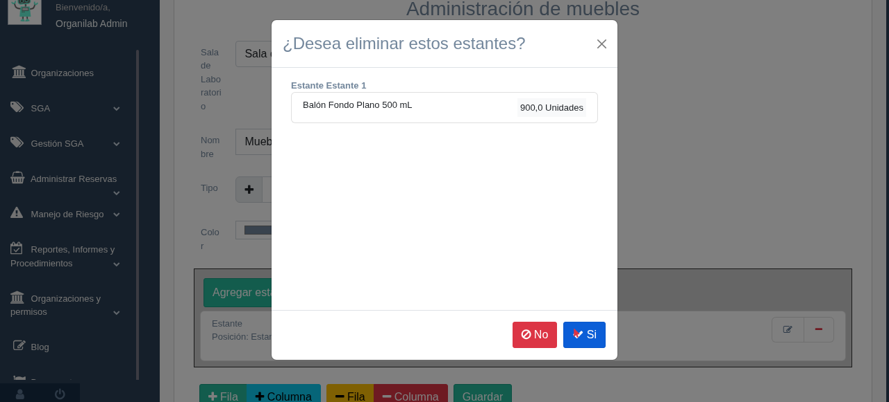

Laboratory administration
===============================

Crear un laboratorio en una organización
---------------------------------------------------

.. image:: ../_static/gif/add_laboratory_to_org.gif
   :height: 380
   :width: 720

Relacionar un laboratorio externo a una organización base
---------------------------------------------------------------

Los laboratorios generados en la organización base podrán ser relacionados en las organizaciones hijas.

.. image:: ../_static/gif/relate_external_laboratory_to_org.gif
   :height: 380
   :width: 720

Relacionar un laboratorio de la organización base a una organización hija
-----------------------------------------------------------------------------------

Los laboratorios generados en la organización base podrán ser relacionados en las organizaciones hijas.

Laboratory view
**********************************

Administración de cuartos de laboratorio
-------------------------------------------
/lab/<int:org>/<int:lab_pk>/create/

Este modulo se utiliza para el manejo de cuartos de laboratorios del laboratorio que se este utilizando en el momento,
para accede ha este modulo existen 2 formas en ambas se requiere el ingreso a un laboratorio, que se mostraran en las siguientes imagenes:

En el primer caso al ingresar al modulo de laboratorio, se debe dar click en la opcion **Laboratorio**

Ejemplo de la primera forma:

En el segundo caso se puede utilizar en diferentes modulos internos del laboratorio a diferencia del anterior,
por el hecho que trabaja con la barra superior, del cual a su vez se da click en la opción **Administracion**,
el cual desplega unas nuevas opciones de acceso donde se debe seleccionar **Administración de laboratorio** para ingresar
al modúlo de cuartos de laboratorio.

Ejemplo de segundo forma:

**Permisos Requeridos:**

*   view_laboratoryroom: Permite visualizar los cuartos que el laboratorio posee.
*   add_laboratoryroom: Permite la creacion de uno nuevo cuarto de laboratorio
*   change_laboratoryroom: Permite ingresar al modulo de actualizar cuarto y visualizar el botón de actualizar.
*   delete_laboratoryroom: Permite eliminar cuarto y visualizar el botón de eliminar.
*   add_furniture: Permite crear un mueble en el cuarto de laboratorio y que se visualize el botón de creación.
*   view_furniture: Permite visualizar los muesble del cuarto de laboratorio.
*   change_furniture: Permite ingresar al modula de edicion de mueble del cuarto y actualizarlos.

Crear sala de laboratorio
**********************************
/lab/<int:org>/<int:lab_pk>/create/

Este modulo creara salas de labororios del laboratorio que se esta utilizando, en estos cuartos normalmente se le asocian
muebles, estantes, objectos entre otras mas temas.

Datos Requeridos:

*   **Nombre:** Este campo registra el nombre del sala.

Permisos requeridos:

*   view_laboratoryroom: Permite visualizar las salas que el laboratorio posee.
*   add_laboratoryroom: Permite la creacion de una nueva sala de laboratorio.

Ejemplo de creacion de sala de laboratorio:

.. image:: ../_static/gif/add_room.gif
   :height: 380
   :width: 720

Actualizar salas de laboratorios
***********************************
/lab/<int:org>/<int:lab_pk>/rooms/<int:pk>/edit

Este modulo actualizara el nombre de las salas de laboratorio.

Datos Requeridos:

*   **Nombre:** Este campo registra el nombre de la sala del laboratorio.

Permisos requeridos:

*   view_laboratoryroom: Permite visualizar las salas que el laboratorio posee.
*   change_laboratoryroom: Permite la creacion de una nueva sala de laboratorio.

Ejemplo de actualización de sala de laboratorio:

.. image:: ../_static/gif/update_room.gif
   :height: 380
   :width: 720

Eliminar sala de laboratorio
**********************************
/lab/<int:org>/<int:lab_pk>/rooms/<int:pk>/delete

En este punto se permitira eliminar salas de laboratorio.
    .. note::
        Al momento de eliminar un cuarto de laboratorio, a su vez eliminara todos los muebles y estantes vinculados a esté.

Datos Requeridos:

*   Acceder a un laboratorio previamente.

Permisos requeridos:

*   view_laboratoryroom: Permite visualizar los cuartos que el laboratorio posee.
*   delete_laboratoryroom: Permite eliminar el cuarto de laboratorio elegido.

Ejemplo de eliminacion de cuartos de laboratorios:

Visualizar salas de laboratorio
**********************************
/lab/<int:org>/<int:lab_pk>/create/

Este modulo permitira visualizar el listado de cuartos de laboratorio del laboratorio que este actualimente utilizando.

Datos Requeridos:

*   Acceder a un laboratorio previamente.

Permisos requeridos:

*   view_laboratoryroom: Permite visualizar los cuartos que el laboratorio posee.

Ejemplo de visualizar de salas de laboratorio:

Administración de muebles
**********************************
Cuando hablamos de muebles se trata de los que son utilizados en las salas de laboratorios, para el almacenamiento de materiales y equipos
dentro de estantes, por lo tanto estos se encuentran asociado a las salas.

Permisos Requeridos:

*   view_laboratoryroom: Permite visualizar los cuartos que el laboratorio posee.
*   add_laboratoryroom: Permite la creacion de uno nuevo cuarto de laboratorio
*   add_furniture: Permite crear un mueble en el cuarto de laboratorio y que se visualize el botón de creación.
*   view_furniture: Permite visualizar los muesble del cuarto de laboratorio.
*   change_furniture: Permite ingresar al modulo de edición de muebles del cuarto y actualizarlos.
*   delete_furniture: Permite eliminar muebles del cuarto.

Creación de muebles
********************
/lab/<int:org>/<int:lab>/furniture/create/<int:room>/

La creación de muebles requiere de 3 los cuales son:

*   **Nombre**: Este campo es obligatorio.
*   **Tipo**: Este campo define el tipo de mueble que es por ejemplo cajon, recipiente, mueble aereo entre otros,
    asimismo este es un campo obligatorio.

Permisos requeridos:

*   view_laboratoryroom: Permite visualizar los cuartos que el laboratorio posee.
*   add_laboratoryroom: Permite la creacion de uno nuevo cuarto de laboratorio
*   add_furniture: Permite crear un mueble en el cuarto de laboratorio y que se visualize el botón de creación.
*   view_furniture: Permite visualizar los muesble del cuarto de laboratorio.

Ejemplo de creación de muebles:

.. image:: ../_static/gif/add_furniture.gif
   :height: 380
   :width: 720

Actualización de mueble
************************

/lab/<int:org>/<int:lab>/furniture/edit/<int:pk>/

La edición de muebles requiere de 4 los cuales son:

*   **Nombre**: Este campo es obligatorio.
*   **Tipo**: Este campo define el tipo de mueble que es por ejemplo cajon, recipiente, mueble aereo entre otros,
*   **Color**: Este campo se utiliza para dar colorear el mueble en la vista de laboratorio, este campo no es obligatorio,

Permisos requeridos:

*   view_laboratoryroom: Permite visualizar los cuartos que el laboratorio posee.
*   change_furniture: Permite editar la informacion referente al mueble.
*   view_furniture: Permite visualizar los mueble del cuarto de laboratorio.

Ejemplo de actualización de muebles:

.. image:: ../_static/gif/update_furniture.gif
   :height: 380
   :width: 720

Crear tipo de mueble
**********************************
catalogs/furniture/furniture_type

Los muebles pueden ser de distintas formas por ejemplo estante, cajon, recipiente entre otros.

Ejemplo de creación de tipos de mueble:

.. image:: ../_static/gif/add_furniture_type.gif
   :height: 380
   :width: 720

Eliminación de mueble
**********************************

/lab/<int:org>/<int:lab>/furniture/delete/<int:pk>/

Para la eliminación de muebles hay que tener en cuenta diversos puntos:

*   Al eliminar un mueble su estantes tambien terminan siendo borrados del sistema.
*   También se eliminarán los objectos, materiales, equipos vinculados a los estantes del mueble.

Por lo tanto a la hora de eliminar un mueble se debe tener en cuenta los puntos anteriores.

Permisos Requeridos:

*   view_laboratoryroom: Permite visualizar los cuartos que el laboratorio posee.
*   view_furniture: Permite visualizar los mueble del cuarto de laboratorio.
*   delete_furniture: Permite visualizar el boton de eliminar mueble en la vista de salas de laboratorio y a su vez eliminarlo.

Ejemplo de eliminación de muebles:

.. image:: ../_static/gif/delete_furniture.gif
   :height: 380
   :width: 720

Administración de estantes
**********************************
/lab/<int:org>/<int:lab>/furniture/edit/<int:pk>/

Los estantes vienen siendo los lugares donde se van almacenar los materiales, equipos y reactivos del laboratorio, a su vez
estos se encuentran asociados a un mueble.

Permisos Requeridos:

*   view_laboratoryroom: Permite visualizar los cuartos que el laboratorio posee.
*   view_furniture: Permite visualizar los mueble del cuarto de laboratorio.
*   change_furniture: Permite ingresar al mueble donde se desea crear los estantes.
*   add_shelf: Permite crear estantes.
*   change_shelf: Permite que aparezca el boton de actualizar estante y editar la información de este.
*   view_shelf: Permite visualizar los estantes.
*   delete_furniture: Permite visualizar el botón de eliminar estante y a su vez eliminarlo.

Como acceder a la vista:

Crear estante
**************
/lab/<int:org>/<int:lab>/shelf/create/<int:pk>/

La creación de estantes requiere de varias datos los cuales se explicaran:

*   **Nombre**: Este campo indica el nombre del estante, a su vez este campo es obligatorio.
*   **Tipo**: Este campo define el tipo de mueble que es por ejemplo cajon, recipiente, mueble aereo entre otros,
    a su vez este campo es obligatorio.
*   **Color**: Este campo se utiliza para dar colorear el mueble en la vista de laboratorio, este campo no es obligatorio,
*   **Desecho**: La función de este campo es la marca como un estado que solo recibira materiales en estado de desecho.
*   **Cantidad infinita**: Este campo se utiliza para indicar que el estante va recibir una cantidad infinita del material, sino se desea que sea
    **ilimitado**, se debe quitar el check del campo.
*   **Cantidad**: Este campo se utiliza para indicar la cantidad limite que el estante va a contener, ademas este campo tiene varias caracteristicas.

    *   La cantidad no puede ser menor o igual a **0**.
    *   Este campo solo aparece si se quita el check en el campo **Cantidad infinita**.
    *   Se vuelve campo obligatorio a la hora de quitar el check en el campo **Cantidad infinita**.

*   **Unidad de medida**: Este campo desplegara un listado de unidades de medida, las cuales se debe seleccionar una, en el caso que se seleccione
    la opción **-----** significa que el estante recibira materiales de cualquier tipo de unidad de medida.
*   **Limita los objetos a agregar**: Este campo su función es la habilitar el campo **Objectos habilitados cuando es limitado**.
*   **Objectos habilitados cuando es limitado**: Este campo contiene un listado de objectos que limitaran los materiales que se puedan registrar en el estante,
    además permite el ingreso de más de un objecto.

Permisos Requeridos:

*   view_laboratoryroom: Permite visualizar los cuartos que el laboratorio posee.
*   view_furniture: Permite visualizar los mueble del cuarto de laboratorio.
*   change_furniture: Permite ingresar al mueble que contiene los estantes.
*   view_shelf: Permite visualizar los estante.
*   add_shelf: Permite crear estantes.

Ejemplo de eliminación de muebles:

Actualizar estante
********************
/lab/<int:org>/<int:lab>/shelf/edit/<int:pk>/<int:row>/<int:col>/

La edicion de estantes permitira modificar los valores mencionados en el punto de **Crear estante**, pero a diferencia
de la ultima funcionalidad mencionada es que limita modificacion de diversos datos los cuales son:

*   **Cantidad**: Este campo tiene diversas validaciones las cuales son:

    *   Nueva cantidad no puede ser inferior a la que ha sido utilizada en el caso que existan materiales dentro del estante.
    *   La cantidad no puede ser menor o igual **0**.
    *   Se vuelve campo obligatorio a la hora de quitar el check en el campo **Cantidad infinita**.

*   **Unidad de medida**: La unidad de medida no puede ser cambiada si hay materiales ingresados, solo se permite cambiar
    a la opción **-------**.
*   **Objectos habilitados cuando es limitado**: No permitira agregar nuevos materiales ni eliminar si existen estos dentro del estante.

Permisos Requeridos:

*   view_laboratoryroom: Permite visualizar los cuartos que el laboratorio posee.
*   view_furniture: Permite visualizar los mueble del cuarto de laboratorio.
*   change_furniture: Permite visualizar el boton de eliminar mueble en la vista de salas de laboratorio y a su vez eliminarlo.
*   view_shelf: Permite visualizar el boton de eliminar mueble en la vista de salas de laboratorio y a su vez eliminarlo.
*   add_shelf: Permite visualizar el boton de eliminar mueble en la vista de salas de laboratorio y a su vez eliminarlo.

Ejemplo de actualización de estantes:

.. image:: ../_static/gif/update_shelf.gif
   :height: 380
   :width: 720

Eliminar estante
*****************

/lab/<int:org>/<int:lab>/shelf/delete/<int:pk>/<int:row>/<int:col>/

Para la eliminacion de muebles hay que tener en cuenta diversos puntos:

*   Al eliminar un mueble su estantes tambien terminan siendo borrados del sistema.
*   También se eliminarán los objectos, materiales, equipos vinculados a los estantes del mueble.

Por lo tanto a la hora de eliminar un mueble se debe tener en cuenta los puntos anteriores.

Permisos Requeridos:

*   view_laboratoryroom: Permite visualizar los cuartos que el laboratorio posee.
*   view_furniture: Permite visualizar los mueble del cuarto de laboratorio.
*   change_furniture: Permite ingresar al mueble.
*   view_shelf: Permite visualizar los estantes.
*   delete_shelf: Permite visualizar el boton de eliminar en los estantes y eliminarlos.

Ejemplo de eliminación de estantes:

.. image:: ../_static/gif/delete_shelf.gif
   :height: 380
   :width: 720

.. warning::
    A la hora de eliminar un estante hay que tener en cuenta que se también los materiales vinculados a este estanto,
    por consiguiente los registros de estos materiales tambien se eliminarán.

Manejo de filas y columnas de estantes
****************************************
/lab/<int:org>/<int:lab>/furniture/edit/<int:pk>/

Unas de las funcionalidades que trae consigo el manejo de estantes son las filas y columnas que se utilizan para,
simular el sitio que se ubican los estantes en los muebles, por lo tanto esta funcion permite la creación y eliminación
de filas y columnas luego de efectuar las acciones deseadas ,se debe dar click en el botón de Guardar si no los cambios
no se mostrarán.

Otro detalle es que a la hora de eliminar una fila con estantes mostrará un listado de estos y los materiales que posee,
en una ventana emergente como se muestra en la siguiente imagen.

Permisos Requeridos:

*   view_laboratoryroom: Permite visualizar los cuartos que el laboratorio posee.
*   view_furniture: Permite visualizar los mueble del cuarto de laboratorio.
*   change_furniture: Permite ingresar al mueble.
*   view_shelf: Permite visualizar los estantes.
*   delete_shelf: Permite eliminar los estantes.

Ejemplo de manejo filas y columnas:

Ejemplo de eliminacion de filas y columnas con estantes:

.. image:: ../_static/gif/manage_rows_cols_shelf.gif
   :height: 380
   :width: 720

Reconstrucción de QR
**********************************

/lab/<int:org>/<int:lab>/rooms/rebuild_laboratory_qr

Administración de objetos
-------------------------------------------

Administración de Reactivos
**********************************

Acá poner el crear  y editar y explicar los íconos de la primera columna de la tabla

Administración de Materiales
**********************************

/lab/<int:org>/<int:lab>/objects/list?type_id=1

Administración de Equipos
**********************************

/lab/<int:org>/<int:lab>/objects/list?type_id=2

Administración de características de objetos
-----------------------------------------------

Explicar para que sirve esta sección

/lab/<int:org>/<int:lab>/features/create/

Administración de proveedores
-------------------------------------------

/lab/<int:org>/<int:lab>/provider/list/

Administración de protocolos
-------------------------------------------

/lab/<int:org>/<int:lab>/protocols/create
