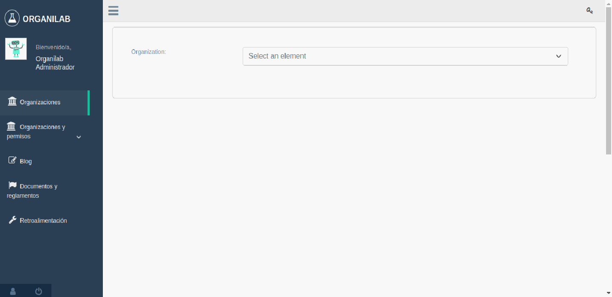
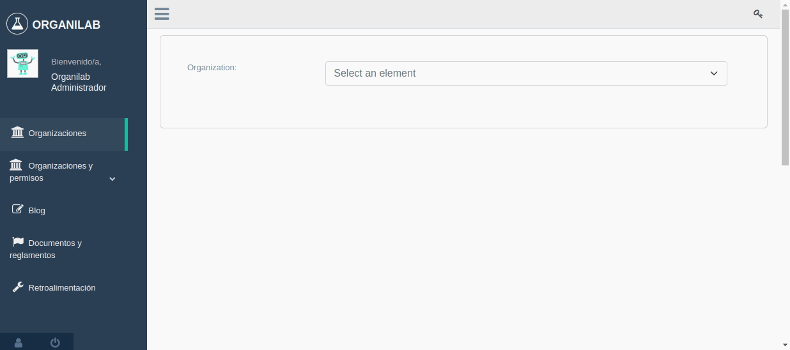
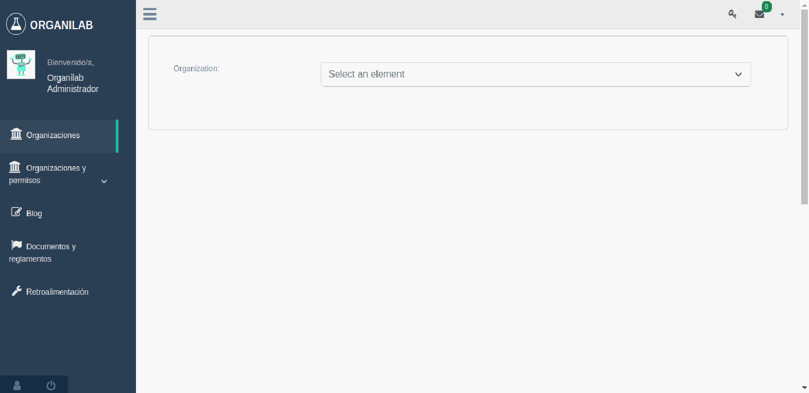
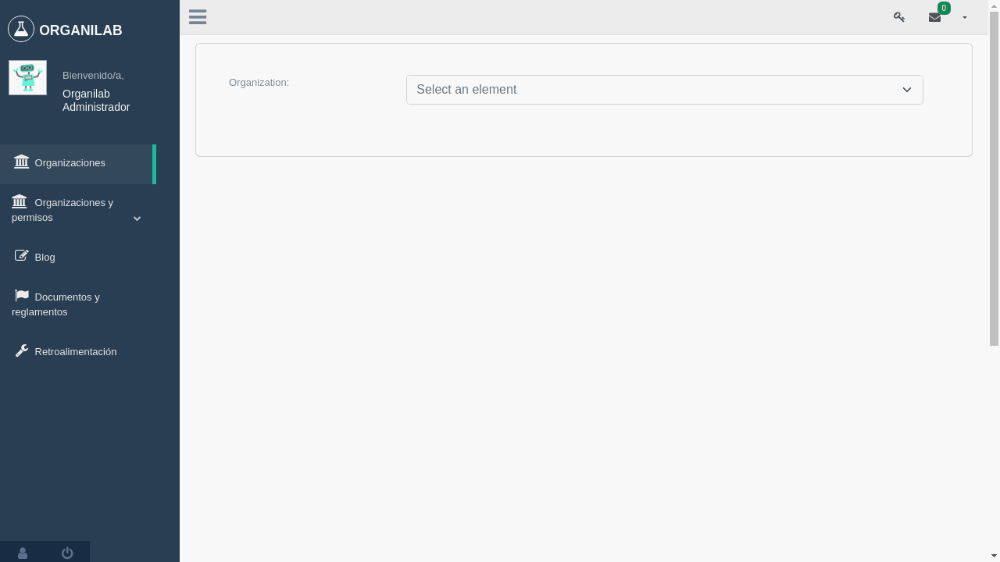
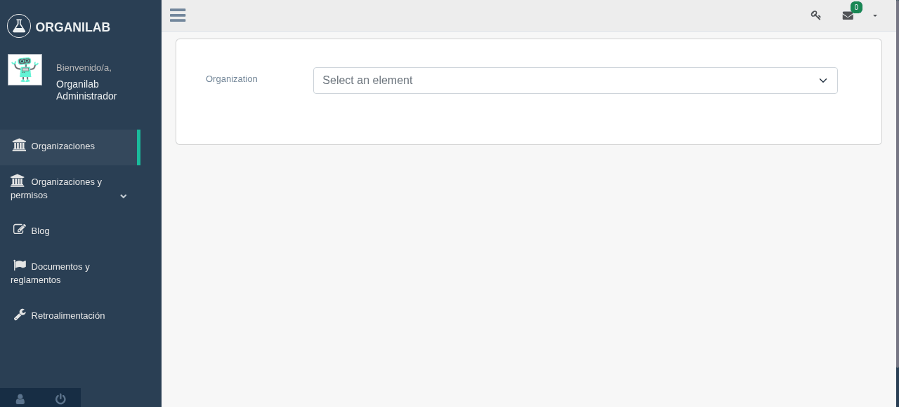

Descripción general del manejo de organización
==================================================

Permisos requeridos:

* *view_organizationstructure*: Permite visualizar el item **"Administración de Organizaciones"** en el menú de la barra lateral.
* *change_organizationstructure*: Autoriza el ingreso a la vista de **"Administración de Organizaciones"**.
* *add_organizationstructure*: Muestra los botones **"Agregar Organización"** y **"+"** que permiten realizar la acción del agregado de organizaciones base y organizaciones hijas.
* *delete_organizationstructure*: Muestra el botón de eliminar organización **"-"** y por consiguiente permite realizar la acción del eliminado de organizaciones.

Crear nueva organización base
----------------------------------

Cuando se menciona una organización base, se hace referencia a la organización raíz (sin antecesor) y que por
consiguiente tendrá a futuro organizaciones descendientes (organizaciones hijas) o en casos menos comunes solo será la
organización (organización única sin antecesor, ni sucesores).

La organización base es la más conveniente a la hora de agregar laboratorios dado que se pueden relacionar estos con
sus organizaciones hijas.

Crear nueva organización hija
----------------------------------

Las organizaciones hijas pueden tener organizaciones descendientes y siempre tendrán una organización base antecesora.

Cambiar el padre de una organización
---------------------------------------

El padre de una organización hace referencia al antecesor de la misma y este puede ser sustituido por otro o
simplemente convertirse en una organización base (organización sin padre). Además las organizaciones base también
pueden llegar a tener un padre y de esta manera ordenar según las necesidades del usuario encargado de gestionar esta
vista.

Eliminar una organización
----------------------------------

Al eliminar una organización es necesario tener en cuenta si ésta tiene o no organizaciones hijas
(organizaciones descendientes) debido a que también las organizaciones hijas serán eliminadas.

Acciones de gestión de una organización
----------------------------------------------

Las acciones de una organización son las siguientes:

* Desactivar organización
* Clonar organización
* Cambiar nombre de la organización

Desactivar una organización
*******************************

Solamente las organizaciones sin hijos pueden desactivarse y contemplarán las siguientes características:

* No se les puede agregar organizaciones hijas.
* Se pueden visualizar las bitácoras.
* No se puede cambiar su padre.
* No se pueden gestionar las acciones (desactivar organización, cambiar el nombre de la organización)
* Si se puede clonar la organización.
* No se puede activar nuevamente la organización.

Clonar una organización
*******************************

Al clonar una organización se copian las siguientes características:

* Nombre con el sufijo *clone*.
* Posición y nivel dentro del árbol de organizaciones.
* Relación con su organización padre (en caso de existir).
* Relaciones con laboratorios u organizaciones.
* Roles.
* Relaciones con usuarios.

Cambiar nombre de una organización
***************************************

El nombre de una organización es un dato requerido no único que puede ser modificado.

Administración de usuarios
----------------------------------

Agregar usuario a una organización desde la botonera de acciones
***********************************************************************

Al agregar un nuevo usuario a una organización se requiere ingresar los datos de este y definir su perfil en la
organización, sea administrador, administrador de laboratorio o usuario de laboratorio.

Relacionar un usuario a una organización desde la botonera de acciones
----------------------------------------------------------------------------

Los usuario listados en este selector serán únicamente los que pertenecen a las organizaciones de las cuales el usuario
en sesión tiene acceso.

Relacionar un usuario externo a una organización y laboratorios
-------------------------------------------------------------------

Un usuario que fue creado y pertenece a otra organización puede ser relacionado a otras organizaciones en caso de ser
requerido y a su vez existe la opción de relacionarlo con los laboratorios de la organización.

Desde la pestaña 'Por Organización'
**************************************

Desde la pestaña 'Por laboratorio'
**************************************

Ver bitácoras de acciones en la organización
--------------------------------------------------

Las acciones de una organización son registros en base a modificaciones, adiciones y remociones
relacionadas a todos los elementos (laboratorios, salas de laboratorio, estantes, objetos, etc) que
contempla dicha organización.

