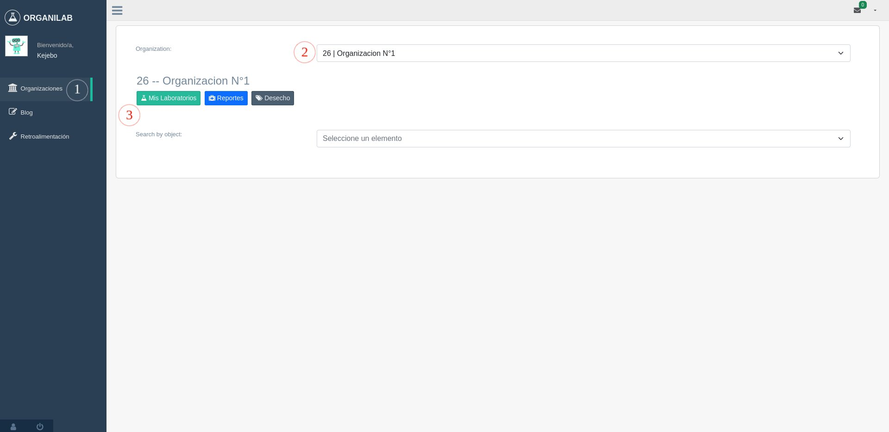
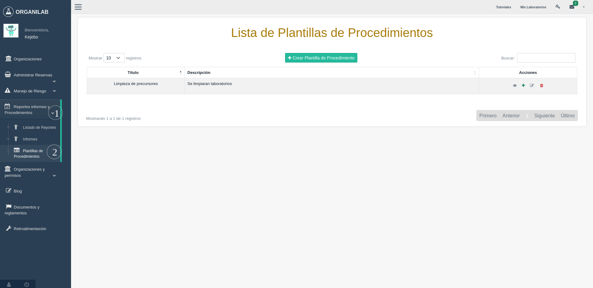
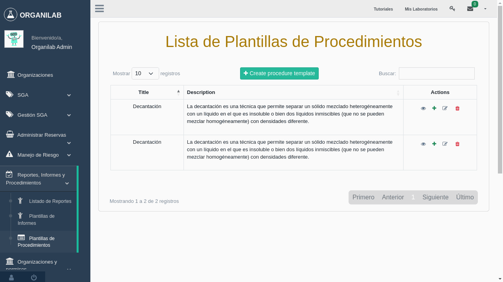
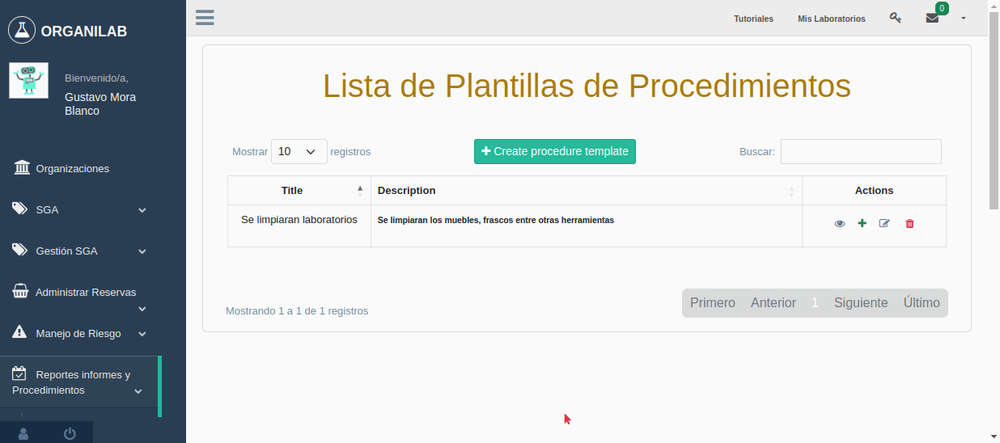
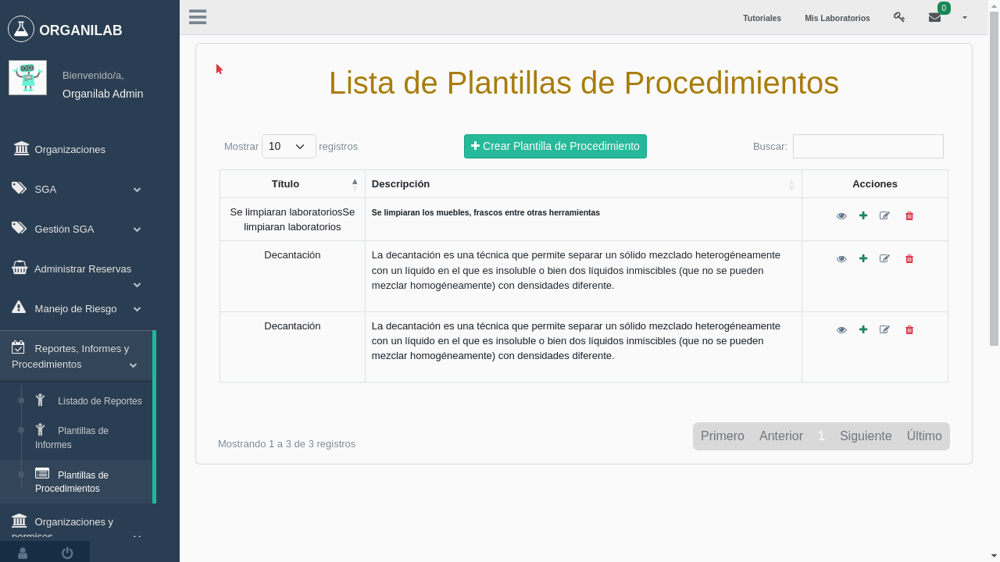
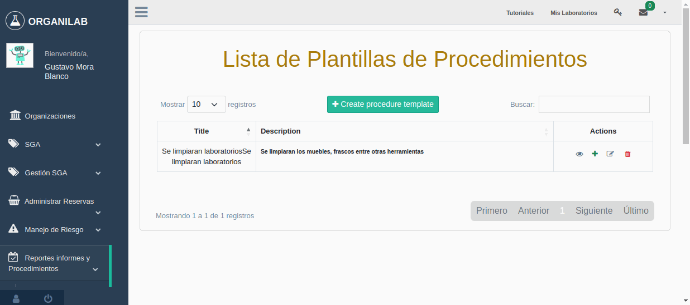
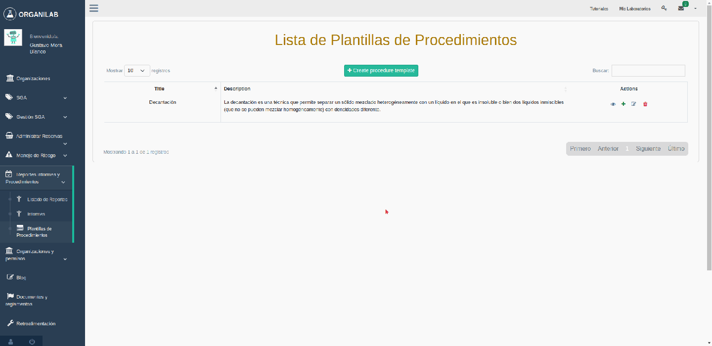
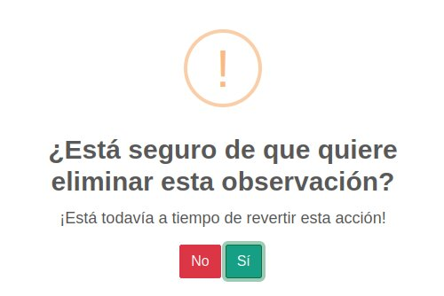
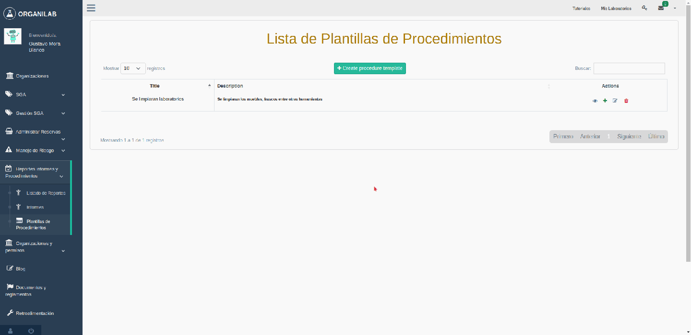

Administrar procedimientos
*******************************

Administrar plantillas de procedimientos
===========================================

Para acceder a este módulo se requieren varios paso que se va a mostrar en las siguientes imágenes:

Explicación de pasos:

*  *Paso 1*: Es dar click en la opción organizaciones de la barra lateral izquierda, porque es necesario haber realizado el ingreso a una organización.
*  *Paso 2*: En este paso se muestra un selector con un listado de organizaciones que el usuario está vinculado, es necesario que seleccione una.
*  *Paso 3*: Al seleccionar una organización es necesario dar clic en uno de los siguientes botones que dan acceso a diversos módulos.

Luego de cumplir con los pasos anteriores en la barra del costado izquierdo se habilitarán mas opciones, por consiguiente se debera dar click a las siguientes opciones:

Explicación de pasos:

*  *Paso 1*: Es dar click en la opción *Reportes, Informes y Procedimientos* de la barra lateral izquierda, esto para habilitar los módulos de informes.
*  *Paso 2*: En este paso se da click en la opción *Plantillas de Procedimientos*, para acceder al módulo de plantillas de procedimiento.

    .. note::
        El usuario debe tener el permiso *view_procedure* para que esta opción sea visible en la barra lateral.

Permisos requeridos:

* *view_procedure*: Permite visualizar el item  y listado de **"Plantillas de procedimientos"**.
* *add_procedure*: Autoriza el ingreso a la vista de **"Creación de plantillas de procedimientos"**.
* *change_procedure*: Autoriza el ingreso a la vista de **"Actualización de plantillas de procedimientos"**.
* *delete_procedure*: Autoriza eliminar una plantilla de procedimiento.
* *view_procedurestep*: Permite visualizar el listado pasos necesarios para la elaboración del procedimiento.
* *add_procedurestep*: Autoriza el ingreso a la vista de **"Creación de pasos del procedimiento"**.

Crear plantilla de procedimientos
-------------------------------------

Cuando se menciona una plantilla de procedimientos, hace referencia a la platilla utilizada para la
elaboración de procedimientos químicos dentro la organización asociada, por lo tanto todos los laboratorios
vinculados a esta tendrán acceso.

Datos Requeridos:

*   *Título*: Este campo registrara el título de la plantilla.
*   *Descripción*: Este campo registrara la descripción del procedimiento, ademas se puede manipular el texto
    ya que el viene integrado con un editor de texto, permitiendo ingresar tipografías, alineación de texto, tablas,
    imagenes entre otras mas funcionalidades que trae consigo un editor de texto.

Permisos requeridos:

* *view_procedure*: Permite visualizar el item  y listado de **"Plantillas de procedimientos"**.
* *add_procedure*: Autoriza el ingreso a la vista de **"Creación de plantillas de procedimientos"**.
* *change_procedure*: Autoriza el ingreso a la vista de **"Actualización de plantillas de procedimientos"**.

Ejemplo de creación de plantilla de procedimiento:

Actualizar plantilla de procedimientos
-----------------------------------------

En la actualización de plantillas funciona de forma similar que la creación de estas el único detalle a tener en cuenta,
es que al modificar algunos de sus datos afecta a los procedimientos que se encuentren en el momento utilizando la plantilla
de procedimientos en el módulos **"Mis procedimientos"**.

Datos Requeridos:

*   *Título*: Este campo registrara el título de la plantilla.
*   *Descripción*: Este campo registrara la descripción del procedimiento, ademas se puede manipular el texto
    ya que el viene integrado con un editor de texto, permitiendo ingresar tipografías, alineación de texto, tablas,
    imágenes entre otras mas funcionalidades que trae consigo un editor de texto.

Permisos requeridos:

* *view_procedure*: Permite visualizar el item  y listado de **"Plantillas de procedimientos"**.
* *add_procedure*: Autoriza el ingreso a la vista de **"Creación de plantillas de procedimientos"**.
* *change_procedure*: Autoriza el ingreso a la vista de **"Actualización de plantillas de procedimientos"**.

Ejemplo de actualizacion de plantilla de procedimiento:

Visualizar plantilla de procedimientos
-----------------------------------------

En esta vista se visualizará la plantilla de procedimiento seleccionada, la cual mostrará la información ingresada,
además de sus pasos con sus objetos y observaciones para la ejecución del procedimiento químico.

Permisos requeridos:

* *view_procedure*: Permite visualizar el item  y listado de **"Plantillas de procedimientos"**.
* *change_procedure*: Autoriza el ingreso a la vista de **"Actualización de plantillas de procedimientos"**.
* *delete_procedurestep*: Permite visualizar el botón de **"Eliminar Paso de plantilla"**.

Agregar pasos
------------------

Cuando se mencionan pasos en una plantilla de procedimientos, se hace referencia a las indicaciones requeridas
a la hora de generar un procedimiento químico, este paso se genera al hacer click en el botón con el símbolo
**+** en la lista de plantillas de procedimientos.

Datos requeridos:

*   *Título*: Este campo registrara el título de la plantilla, si no se ingresa ningún palabra este título se mostrará,
    en la visualización de plantillas de procedimientos como **"Desconocido"**.
*   *Descripción*: Este campo registrara la descripción del procedimiento, además se puede manipular el texto
    ya que el viene integrado con un editor de texto, permitiendo ingresar tipografías, alineación de texto, tablas,
    imágenes entre otras mas funcionalidades que trae consigo un editor de texto.

Permisos Requeridos:

*   *add_procedurestep*: Autoriza ingresar a la vista de **Crear Paso**.

**Ejemplo de agregar un paso de una plantilla de procedimiento**:

Actualizar pasos
--------------------

La actualización de pasos se ejecuta de forma similar que la actualización de plantillas de procedimientos con los mismos
campos.

Datos requeridos:

*   *Título*: Este campo registrara el título de la plantilla, si no se ingresa ningún palabra este título se mostrará, en la visualización de plantillas de procedimientos como **"Desconocido"**.
*   **Descripción**: Este campo registrara la descripción del procedimiento, además se puede manipular el texto
    ya que el viene integrado con un editor de texto, permitiendo ingresar tipografías, alineación de texto, tablas,
    imágenes entre otras mas funcionalidades que trae consigo un editor de texto.

Permisos Requeridos:

*   *add_procedurestep*: Autoriza ingresar a la vista de **Crear Paso**.

**Ejemplo de actualizar un paso de una plantilla de procedimiento**:

Agregar objetos en los pasos
---------------------------------

Cuando hablamos de objetos dentro los pasos son el listado de materiales utilizados en los procedimientos, los cuales
serán reservados para más información de este revisar la viñeta **Generar Reservación de Procedimiento**.

Datos requeridos:

*   *Objeto*: Este campo es un selector con un listado de objetos vinculados a la organización, es obligatorio
    escoger una opción.
*   *Cantidad*: Este campo anota la cantidad a utilizar del material u objeto utilizar en el procedimiento, además
    la cantidad mínima a ingresar debe ser de **0.0000001** si esta cantidad es inferior al mínimo sobre este campo
    aparece el mensaje.

    .. warning::
        **Asegúrese de que este valor es mayor o igual a 1e-07**.

*   *Unidad de medida*: Este campo hace referencia a la unidad de medida del objeto seleccionado, a su vez es
    obligatoria la selección de una opción.

Permisos requeridos:

*   *add_procedurerequiredobject*: Permite agregar objetos a los pasos de la plantilla de procedimientos.

**Ejemplo de agregar de objeto**:

Descartar objeto
----------------------

Al descartar un objeto viene siendo, igual que eliminarlo, pero de un paso no estamos hablando de borrarlo del
sistema en sí, hay un detalle que se debe tomar en cuenta a la hora de eliminar y es que afecta procedimientos que este
relacionado con la plantilla.

Permisos requeridos:

*   *delete_procedurerequiredobject*: Permite eliminar un objeto de los pasos de la plantilla de procedimientos.

**Ejemplo de descarte de objeto**:

Agregar observación
----------------------

Las observaciones son las indicaciones preventivas para manipulación de los objetos.

Datos requeridos:

*   *Descripción*: En este campo se ingresara el detalle de la observación.

Permisos requeridos:

*   *add_procedureobservations*: Autoriza el agregar observaciones en los pasos.

**Ejemplo de creación de observación**:

Eliminar observación
----------------------

Al dar click en el ícono de eliminar de la observación seleccionada se mostrará la siguiente ventana.

.. note::
    Si se presiona la opción **Si**, se elimina la observación, pero si presiona la opción **No**, no se elimina la observación.

Permisos Requeridos:

*   *delete_procedureobservations*: Autoriza el agregar observaciones en los pasos.

Ejemplo de eliminación de observación:

Eliminar paso
--------------------

Para eliminar un paso de una plantilla plantilla de procedimientos se debe tener en cuenta varios aspectos:

*   Al eliminar un paso se removerán todos los objetos que poseen que por consecuencia afectaría el procedimiento.
*   También se removerán las obsevaciones asociadas a la plantilla.

Permisos Requeridos:

* *change_procedure*: Autoriza el ingreso a la vista de **"Actualización de plantillas de procedimientos"**.
* *delete_procedure*: Autoriza eliminar una plantilla de procedimiento.
* *view_procedurestep*: Permite visualizar el listado pasos necesarios para la elaboración del procedimiento.
* *delete_procedurestep*: Permite visualizar el botón de eliminar paso en la vista **"Actualización de plantillas de procedimientos"**
    y autoriza su eliminación.

.. important::
    **Nota**: Hay que tener en cuenta a la hora de modificar o eliminar un **Paso,** este también afecta a los procedimientos,
    que anteriormente han utilizado la plantilla, esto provocando cambios en la generación de reservas de materiales,
    de procedimientos que usa esta plantilla de referencia.

Eliminar plantilla de procedimientos
-----------------------------------------

Para eliminar una plantilla plantilla de procedimientos se debe tener en cuenta varios aspectos:

*   Los procedimientos vinculados a esta plantilla en consecuencia de la eliminación terminarán sin plantilla,
    por lo tanto, se recomienda cambiar la plantilla del procedimiento.
*   También se van a eliminar los pasos y observaciones.
*   No solo las plantillas de la organización serán afectadas, sino que las organizaciones hijas se verán influenciadas.

**Ejemplo de eliminación de plantilla**:

Permisos Requeridos:

* *delete_procedure*: Autoriza eliminar una plantilla de procedimiento.
* *view_procedure*: Permite visualizar las lista de plantillas de procedimientos de la organización.
