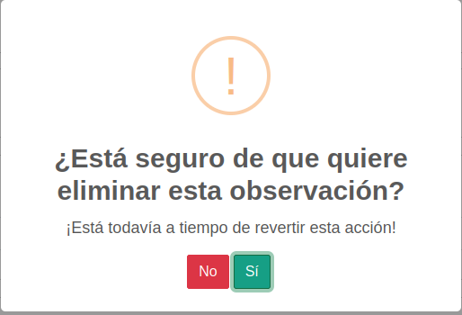

Administrar plantillas de procedimientos
*****************************************

/academic/<int:org>/procedure/procedure_list/

* **"view_procedure"**: Permite visualizar el item  y listado de **"Plantillas de procedimientos"**.

* **"add_procedure"**: Autoriza el ingreso a la vista de **"Creacion de plantillas de procedimientos"**.

* **"change_procedure"**: Autoriza el ingreso a la vista de **"Actualizacion de plantillas de procedimiento"s**.

* **"delete_procedure"**: Autoriza eliminar una plantilla de procedimiento.

* **"view_procedurestep"**: Permite visualizar el listado pasos necesarios para la elaboración del procedimiento.

* **"add_procedurestep"**: Autoriza el ingreso a la vista de **"Creación de pasos del procedimiento"**.

Crear plantilla de procedimientos
==================================
academic/<int:org>/procedure/procedure_create/

Cuando se menciona una plantilla de procedimientos, se hace referencia a la platilla utilizada para la
elaboracion de procedimientos quimicos dentro la organizacion asociada por lo tanto todos los laboratorios
vinculados a esta tendrán acceso.

Datos Requeridos:

*   **Titulo**: Este campo registrara el titulo de la plantilla.

*   **Descripcion**: Este campo registrara la descripcion del procedimiento, ademas se puede manipular el texto
    ya que el viene integrado con un editor de texto, permitiendo ingresar tipografías, alineacion de texto, tablas,
    imagenes entre otras mas funcionalidades que trae consigo un editor de texto.

Permisos requeridos:

* **"view_procedure"**: Permite visualizar el item  y listado de **"Plantillas de procedimientos"**.

* **"add_procedure"**: Autoriza el ingreso a la vista de **"Creacion de plantillas de procedimientos"**.

* **"change_procedure"**: Autoriza el ingreso a la vista de **"Actualizacion de plantillas de procedimiento"s**.

Actualizar plantilla de procedimientos
=======================================

academic/<int:org>/procedure/procedure_update/<int:pk>/

En la actualización de plantillas funciona de forma similar que la creacion de estas el unico detalle a tener en cuenta,
es que al modificar algunos de sus datos afecta a los procedimientos que se encuentren en el momento utilizando la plantilla
de procedimientos en el modulos **"Mis procedimientos"**.

Datos Requeridos:

*   **Titulo**: Este campo registrara el titulo de la plantilla.

*   **Descripcion**: Este campo registrara la descripcion del procedimiento, ademas se puede manipular el texto
    ya que el viene integrado con un editor de texto, permitiendo ingresar tipografías, alineacion de texto, tablas,
    imagenes entre otras mas funcionalidades que trae consigo un editor de texto.

Permisos requeridos:

* **"view_procedure"**: Permite visualizar el item  y listado de **"Plantillas de procedimientos"**.

* **"add_procedure"**: Autoriza el ingreso a la vista de **"Creacion de plantillas de procedimientos"**.

* **"change_procedure"**: Autoriza el ingreso a la vista de **"Actualizacion de plantillas de procedimiento"s**.

Visualizar plantilla de procedimientos
=======================================

academic/<int:org>/procedure/procedure_detail/<int:pk>/

En esta vista se visualizara la plantilla de procedimiento seleccionada, la cual mostrara la informacion ingresada,
ademas de sus pasos con sus objectos y observaciones para la ejecucion del procedimiento quimico.

Permisos requeridos:

* **"view_procedure"**: Permite visualizar el item  y listado de **"Plantillas de procedimientos"**.

* **"change_procedure"**: Autoriza el ingreso a la vista de **"Actualizacion de plantillas de procedimientos"**.

* **"delete_procedurestep"**: Permite visualizar el boton de **"Eliminar Paso de plantilla"**.

Agregar pasos
==============

academic/<int:org>/procedure/add_steps_wrapper/<int:pk>/

Cuando se mencionan pasos en una plantilla de procedimientos, se hace referencia a las indicaciones requeridadas
a la hora de generar un procedimiento quimico, este paso se genera por defecto dando click en el boton con el simbolo
**+** en la listas de plantillas de procedimientos.

Datos requeridos:

*   **Titulo**: Este campo registrara el titulo de la plantilla, si no se ingresa ningun palabra este titulo se mostrara,
    en la visualizacion de plantillas de procedimientos como **"Desconocido"**.

*   **Descripcion**: Este campo registrara la descripcion del procedimiento, ademas se puede manipular el texto
    ya que el viene integrado con un editor de texto, permitiendo ingresar tipografías, alineacion de texto, tablas,
    imagenes entre otras mas funcionalidades que trae consigo un editor de texto.

Permisos Requeridos:

*   **"add_procedurestep"**: Autoriza ingresar a la vista de **Crear Paso**.

**Ejemplo de agregar un paso de una plantilla de procedimiento**:

.. video:: ../_static/procedure/video/add_procedure_step.mp4
  :width: 600
  :height: 400

Actualizar pasos
=================

academic/<int:org>/procedure/step/<int:pk>/update/

En la actualizacion de pasos trabaja de forma similar que la actualizacion de plantillas de procedimientos con los mismos
campos.

Datos requeridos:
*   **Titulo**: Este campo registrara el titulo de la plantilla, si no se ingresa ningun palabra este titulo se mostrara, en la visualizacion de plantillas de procedimientos como **"Desconocido"**.

*   **Descripcion**: Este campo registrara la descripcion del procedimiento, ademas se puede manipular el texto
    ya que el viene integrado con un editor de texto, permitiendo ingresar tipografías, alineacion de texto, tablas,
    imagenes entre otras mas funcionalidades que trae consigo un editor de texto.

Permisos Requeridos:

*   **"add_procedurestep"**: Autoriza ingresar a la vista de **Crear Paso**.

**Ejemplo de actualizar un paso de una plantilla de procedimiento**:

.. video:: ../_static/procedure/video/update_procedure_step.mp4
  :width: 600
  :height: 400

Agregar objectos en los pasos
==============================

academic/<int:org>/procedure/save_object/<int:pk/

Cuando hablamos de objectos dentro los pasos son el listado de materiales utilizados en los procedimientos, los cuales
seran reservados para mas informacion de este revisar la viñeta **Generar Reservacion de Procedimiento**.

Datos requeridos:

*   **Objecto**: Este campo es un selector con un listado de objectos vinculados a la organización, es obligatorio
    escoger una opción.

*   **Cantidad**: Este campo anota la cantidad a utilizar del material u objecto utilizar en el procedimiento, ademas
    la cantidad minima a ingresar debe ser de **0.0000001** si esta cantidad es inferior al minimo sobre este campo
    aparece el mensaje.

    .. warning::
        **Asegúrese de que este valor es mayor o igual a 1e-07**.

*   **Unidad de medida**: Este campo hace referencia a la unidad de medida del objecto seleccionado, a su vez es
    obligatoria la seleccion de una opcion.

Permisos requeridos:

*   **"add_procedurerequiredobject"**: Permite agregar objectos a los pasos de la plantilla de procedimientos.

**Ejemplo de agregar de objecto**:

.. video:: ../_static/procedure/video/add_step_object.mp4
  :width: 600
  :height: 400

Descartar objecto
==================

academic/<int:org>/procedure/remove_object/<int:pk/

Al descartar un objecto de un viene siendo, igual que eliminarlo pero de un paso no estamos hablando de borralo del
sistema en sí, hay un detalle que se debe tomar en cuenta a la hora de eliminar y es que afecta procedimientos que este
relacionado a la plantilla.

Permisos requeridos:

*   **"delete_procedurerequiredobject"**: Permite eliminar un objecto de los pasos de la plantilla de procedimientos.

**Ejemplo de descarte de objecto**:

.. video:: ../_static/procedure/video/remove_step_object.mp4
  :width: 600
  :height: 400

Agregar observación
====================

academic/<int:org>/procedure/add_observation/<int:pk>/

Las observaciones son las indicaciones preventivas para manipulacion de los objectos.

Datos requeridos:

*   **Descripcion**: En este campo se ingresara el detalle de la observacion.

Permisos requeridos:

*   **"add_procedureobservations"**: Autoriza el agregar observaciones en los pasos.

**Ejemplo de creacion de observación**:

.. video:: ../_static/procedure/video/add_step_observation.mp4
  :width: 600
  :height: 400

Eliminar observacion
=====================

academic/<int:org>/procedure/remove_observation/<int:pk>/

Al dar click en icono eliminar de la observacion seleccionada se mostrara la siguiente ventana.

Permisos Requeridos:

*   **"delete_procedureobservations"**: Autoriza el agregar observaciones en los pasos.

Eliminar paso
=================

academic/<int:org>/procedure/step/delete/

Para eliminar un paso de una plantilla plantilla de procedimientos se debe tener en cuenta varios aspectos:

*   Al eliminar un paso se borran todos los objectos que poseen que por consecuencia afectaría procedimientos que esten,
    utilizando esta como base como se explico.

*   Tambien se eliminaran las obsevaciones.

Permisos Requeridos:

* **"change_procedure"**: Autoriza el ingreso a la vista de **"Actualizacion de plantillas de procedimientos"**.

* **"delete_procedure"**: Autoriza eliminar una plantilla de procedimiento.

* **"view_procedurestep"**: Permite visualizar el listado pasos necesarios para la elaboración del procedimiento.

* **"delete_procedurestep"**: Permite visualizar el boton de eliminar paso en la vista **"Actualizacion de plantillas de procedimientos"**
    y autoriza su eliminacion.

.. important::
    **Nota**: Hay que tener en cuenta a la hora de modificar o eliminar un **Paso** este tambien afecta a los procedimientos,
    que anteriormente han utilizado la plantilla, esto provocando cambios en la generaciòn de reservas de materiales,
    de procedimientos que usa esta plantilla de referencia.

Eliminar plantilla de procedimientos
=====================================

academic/<int:org>/procedure/delete_procedure/

Para eliminar una plantilla plantilla de procedimientos se debe tener en cuenta varios aspectos:

*   Los procedimientos vinculados a estos se eliminara su plantilla.
*   Tambien se eliminaran los pasos.
*   No solo las plantillas de la organizacion seran afectadas sino que las organizaciones hijas se veran influenciadas.

**Ejemplo de eliminación de plantilla**:

.. video:: ../_static/procedure/video/delete_procedure_template.mp4
  :width: 600
  :height: 400

Permisos Requeridos:

* **"delete_procedure"**: Autoriza eliminar una plantilla de procedimiento.

* **"view_procedure"**: Permite visualizar las lista de plantillas de procedimientos de la organizacion.
