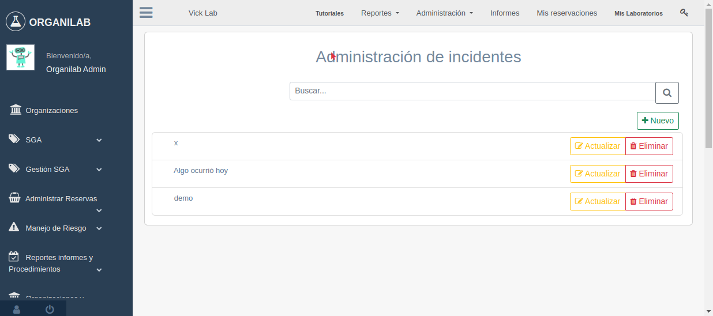
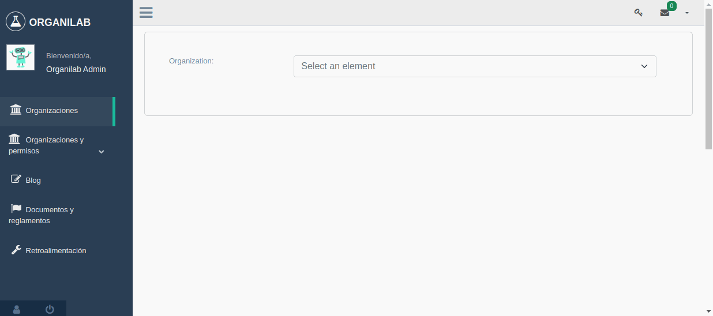
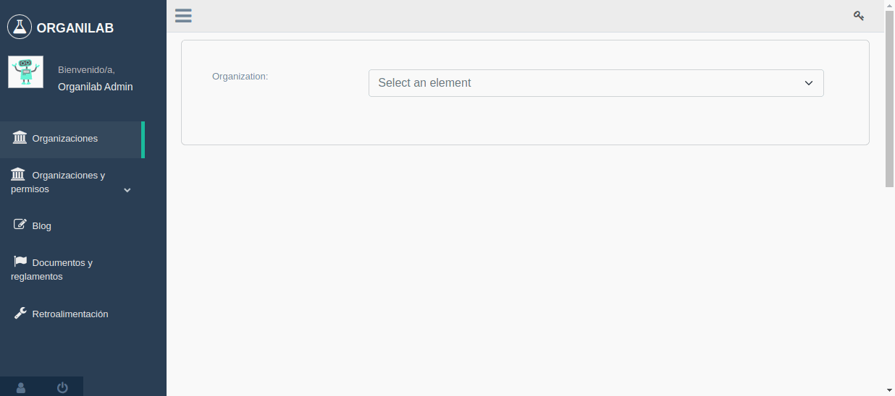
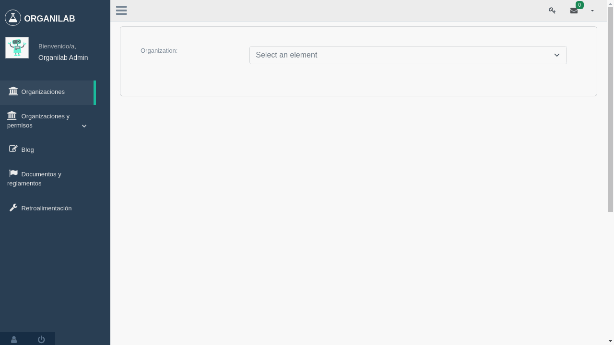

Administración de zona de riesgo
************************************

Este modulo se encarga del manejo de zonas de riesgos de organización, que es una zona riesgo, esto puede ser un laborato
rio, sitios o lugares dentro de la institución.

Actualmente existen 2 maneras para acceder al módulo de las siguientes formas:

*   **Primera Forma**:

    .. image:: ../_static/gif/view_risk.gif
        :height: 380
        :width: 720

*   **Segunda Forma**:

    .. image:: ../_static/gif/view_risk_sidebar.gif
        :height: 380
        :width: 720

Permisos requeridos para manipular el modulo:

*   **view_riskzone** Permite ingresar al modulo de zonas de riesgo.
*   **add_riskzone** Permite crear zonas de riesgos.
*   **change_riskzone** Permite editar zonas de riesgos.
*   **delete_riskzone** Permite eliminar zonas de riesgos.
*   **add_zonetype** Permite crear tipos de zonas de riesgos.
*   **view_incidentreport** Permite visualizar los incidentes de los laboratorios.
*   **add_incidentreport** Permites agregar incedentes.
*   **change_incidentreport**: Permite la edición de la información de un incidente.
*   **delete_incidentreport**: Permite eliminar los incidentes.
*   **do_report**: Permite descargar los datos de los incidentes.

Crear Zona de riesgo
========================

Campos requeridos:

*   **Nombre**: Es un campo obligatorio
*   **Laboratorios**: Este campo lista los laboratorios vinculados en la organización se pueden seleccionar 1 o mas opci
    ones.
*   **Número de trabajadores**: Este campo se ingresada una cantidad aproximada de personas que laboran en los laboratorios
    este campo solo acepta valores numericos.
*   **Tipo de Zona**: Este campo se utiliza para categoría la zona de riego es obligatoria la selección de una.

Permisos requeridos:

*   *view_riskzone*: Permite ingresar al módulo de zonas de riegos.
*   *add_riskzone*: Permite crear zonas de riesgos.

Ejemplo de creacion de zona de riesgo:

Editar Zona de riesgo
========================

En la edición de zonas de riesgos se permitirá modificar cualquier dato de los mencionados en el punto de **Crear zonas
de riesgos**.

Permisos requeridos:

*   *view_riskzone*: Permite ingresar al módulo de zonas de riegos.
*   *change_riskzone*: Permite modificar la informacion de las zonas de riesgos.

Ejemplo de edición de zona de riesgo:

Detalle de Zona de riesgo
===============================

Para visualizar el detalle interno de una zona riesgo se puede realizar de la siguiente forma:

..  note::
    Dentro del detalle se logran visualizar los laboratorios asociados a la zona riesgo y al costado derecho de estos un
    botón pequeño de color gris que muestra la cantidad de incidentes que han sucedido en él.

Permisos requeridos:

*   *view_riskzone*: Permite visualizar las zonas de riesgos e ingresar al detalle de estos.

Agregar tipo de zona de riesgo
======================================

Los tipos de zona de riesgo sirve para categororizar la zona afectada del o los laboratorios asoscdos.

Campo reqierodps:

*   **Nombre**: Es el nombre del tipo de zona.
*   **Prioridad de operaciones**: Este campo registrará el grado de prioridad de la zona de riesgo, además se podra
    seleccionar una o mas opción

Permisos requeridos:

*   *view_riskzone*: Permite ingresar al módulo de zonas de riesgos.
*   *add_riskzone*: Permite ingresar a la creación de zonas de riesgo.
*   *add_zonetype*: Permite la creación de tipos de zona de riesgo.

Ejemplo de creación de tipos de zona de riesgos:

Eliminar Zona de riesgo
=============================

Para eliminar una zona de riego se efectúa de la siguiente manera:

..  caution::
    A la hora de eliminar una zona de riesgo todo los incidentes vinculados a esta tambien se remueven.

Permisos requeridos:
*   *view_riskzone*: Permite visualizar las zonas de riesgos.
*   *delete_riskzone* Permite eliminar la zona de riesgo.

Ver incidentes
========================

Como se ha mencionado anteriormente las zonas de riesgos poseen incidentes que son los sucesos o artercados que suceden
dentro de los laboratorios de la organizacion que afectan la infraestructuro, materiales y personal de la organización,
se puede aceeder a la vista de la siguiente forma:

Permisos requeridos:

*   *view_riskzone*: Permite visualizar el detalle de la zona de riesgo.
*   *view_incident*: Permite visualizar los incidentes dentro de los laboratorios de la organizacion.

Crer incidente
========================

Para la creacion de un incidente se requiere el ingreso de 9 campos que son obligatorios de ingresar.

Campos requeridos:

*   **Descipción corta:** Este campo ingresa una descripción corta sobre el incidente.
*   **Fecha del incidente:** Este ccampo registra la hora del incidente.
*   **Laboratorios:** Este campo listará todos los laboratorios vinculados a la oraganización, se puede seleccionar 1 o
    más laboratorios.
*   **Causas del accidente:** Este campo registrará una descripción sobre el la causa del incidente.
*   **Impacto a la infraestructura:** Este campo registra una descripcion sobre los daños infraestructurales.
*   **Impacto a las personas:** Este campo registra el grupo de personas que fueron afectadas en el incidente.
*   **Impacto ambiental:** Este campo registra el impacto sobre el ambiente que produce el incidente.
*   **Resultado de la implementación del Plan de Prevención:** Este campo sirve para describir si los planes de prevención
    de ese tipo de casos funcionaron o no.
*   **Medidas adoptadas para corregir la situación y para atenuar sus efectos**.
*   **Recomendaciones**.
*   **Copia de la notificación:** Este campo almacenara la copia de notificación realizada al Centro Nacional de Control
    de Intoxicaciones (CNCI) en caso de intoxicación de personas, a diferencia de los campos anteriores este no es
    obligatorio su ingreso.

Ejemplo de creación de incidente:

Permisos requeridos:

*   *view_riskzone*: Permite visualizar el detalle de la zona de riesgo.
*   *view_incident*: Permite visualizar los incidentel de los aboratorios vinculados en la zona de riesgo.
*   *add_incident*: Permite crear incidentes

Editar incidente
========================

En la edicion de incidente se pernmitira modificar todos los campos mencionadas en el punto **Crear Incidente** de la
siguiente forma:

Permisos requeridos:

*   *view_riskzone*: Permite visualizar el detalle de la zona de riesgo.
*   *view_incident*: Permite visualizar los incidentel de los aboratorios vinculados en la zona de riesgo.
*   *change_incident*: Permite editar la informacion de los incidentes.

Eliminar incidente
========================

La eliminación de un incidente se puede realizar de la siguiente forma:

Permisos requeridos:

*   *view_riskzone*: Permite visualizar el detalle de la zona de riesgo.
*   *view_incident*: Permite visualizar los incidentel de los aboratorios vinculados en la zona de riesgo.
*   *delete_incident*: Permite eliminar incidentes

Descarga de reporte de incidentes
==========================================
Los incidentes se puede descargar em diversos formate los cuales son:

*   **Xlss**
*   **PDF**
*   **OdS**
*   **Xls**

Ejemplo de descargar incidentes en zonas de riesgos:

Permisos requeridos:

*   *view_riskzone*: Permite visualizar el detalle de la zona de riesgo.
*   *view_incident*: Permite visualizar los incidentes de las zonas de riesgos.
*   *do_report*: Permite descargar la información del incidente.

