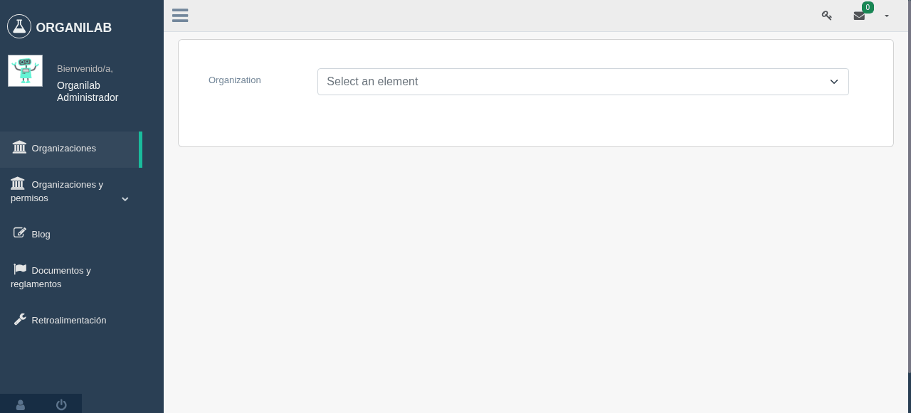
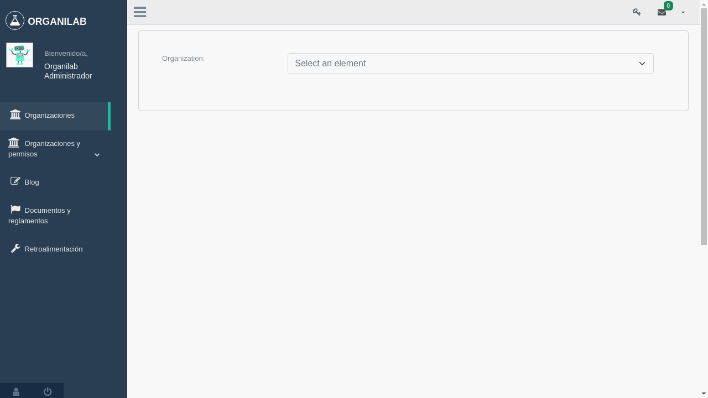
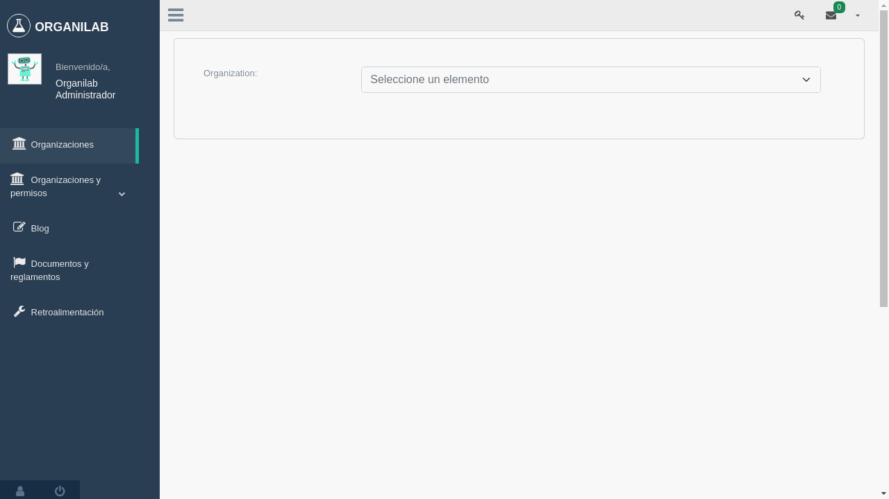
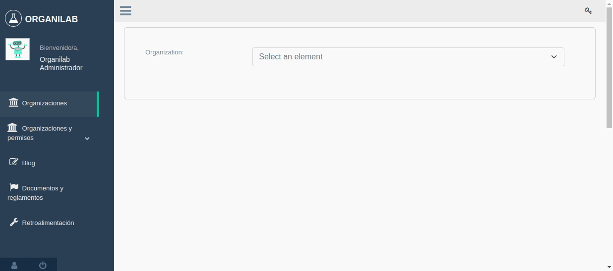

Administración de roles
****************************

Agregar nuevo rol sin copia de permisos de otros roles
===========================================================

Los roles pueden ser creados sin permisos y conforme se navegue en la plataforma se puede ir agregando permisos al
mismo.

Agregar nuevo rol con copia de permisos de otros roles
==========================================================

Este paso facilita a la hora de querer unificar permisos de otros roles en uno solo o simplemente mantener los permisos
bajo un nombre diferente de rol.

Copiar rol a una organización
==================================

Incluye el copiado de las siguientes características:

* Nombre
* Color
* Permisos

Listar roles de una organización
====================================

Permite consultar que roles y permisos están asociados a una organización, así como la posibilidad de eliminarlos
siempre y cuando se tenga los privilegios (permisos) necesarios de un administrador.

Eliminar un rol de una organización
========================================

Al eliminar un rol se remueven todas sus relaciones con perfiles de permisos y organizaciones, por lo tanto es necesario
estar seguro antes de hacerlo porque es un cambio definitivo.

Administrar roles de permisos a un usuario por laboratorio desde la pestaña "Por laboratorio"
================================================================================================

Agregar rol de permisos a un usuario
----------------------------------------

Todos los roles de permisos seleccionados se asignarán a ese usuario en ese laboratorio.

Remover rol de permisos a un usuario
----------------------------------------

Remoción de todos los roles de permisos seleccionados a ese usuario en ese laboratorio.

Usar rol seleccionado de permisos y asignarlos a un usuario
-----------------------------------------------------------------

Este paso implica las siguientes acciones:

* Remoción completa de todos los roles de permisos a ese usuario en ese laboratorio.
* Asignación de todos roles de permisos que fueron seleccionados a ese usuario en ese laboratorio.

Administrar roles por organización desde la pestaña "Por Organización"
=========================================================================

Agregar rol de permisos a un usuario
----------------------------------------

Todos los roles de permisos seleccionados se asignarán a ese usuario en esa organización.

Remove rol de permisos a un usuario
--------------------------------------

Remoción de todos los roles de permisos seleccionados a ese usuario en esa organización.

Usar rol seleccionado de permisos y asignarlos a un usuario
==================================================================

Este paso implica las siguientes acciones:

* Remoción completa de todos los roles de permisos a ese usuario en esa organización.
* Asignación de todos roles de permisos que fueron seleccionados a ese usuario en esa organización.

Eliminar relación entre usuario y laboratorio desde la pestaña "Por laboratorio"
====================================================================================

Opción disponible para desvincular a un usuario de un laboratorio, así como también desactivarlo de la plataforma.

Eliminar relación entre usuario y laboratorio
--------------------------------------------------

Eliminar relación entre usuario y laboratorio y desactivar usuario de la plataforma
----------------------------------------------------------------------------------------

Eliminar relación entre usuario y organización desde la pestaña "Por Organización"
------------------------------------------------------------------------------------------

Opción disponible para desvincular a un usuario de una organización, así como también desactivarlo de la plataforma.

Al ser desvinculado también pierde su relación con los laboratorios presentes en esta organización de los cuales el
usuario sea parte.

Eliminar relación entre usuario y organización
==================================================

Eliminar relación entre usuario y organización y desactivar usuario de la plataforma
---------------------------------------------------------------------------------------

Administrar grupos de permisos por perfil
==============================================

Los grupos de permisos son grupos pre definidos y personalizados por el administrador que pueden llegar a ser asignados
a los usuarios según se requiera.

