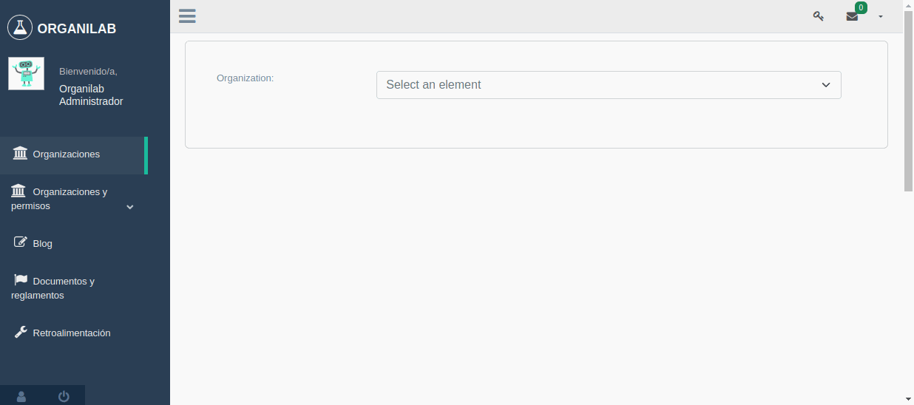

Administración de roles
===========================

Agregar nuevo rol sin copia de permisos de otros roles
----------------------------------------------------------------

.. image:: ../_static/gif/add_role_to_org_without_copy_permissions_from_others_roles.gif
   :height: 380
   :width: 720

Agregar nuevo rol con copia de permisos de otros roles
----------------------------------------------------------------

.. image:: ../_static/gif/add_role_to_org_copy_permissions_from_others_roles.gif
   :height: 380
   :width: 720

Copiar rol a una organización
----------------------------------------------------------------

.. image:: ../_static/gif/copy_role_to_org.gif
   :height: 380
   :width: 720

Listar roles de una organización
--------------------------------------------

.. image:: ../_static/gif/view_org_roles.gif
   :height: 380
   :width: 720

Eliminar un rol de una organización
--------------------------------------------

.. image:: ../_static/gif/delete_org_role.gif
   :height: 380
   :width: 720

Consideraciones de eliminar un rol.

Administrar roles a un usuario por laboratorio
-------------------------------------------------

Administrar roles por organización
--------------------------------------------

Acá mostrar como gestionar roles por "Organización"

Administrar grupos de permisos por perfil
-----------------------------------------------

.. image:: ../_static/gif/change_profile_permission_group_by_org.gif
   :height: 380
   :width: 720
