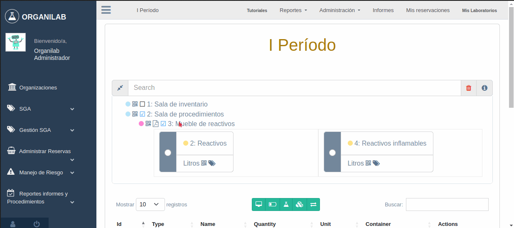
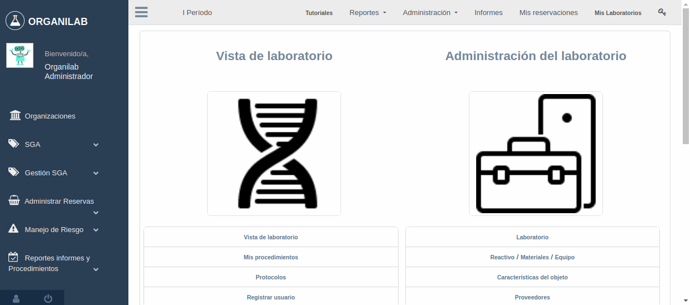
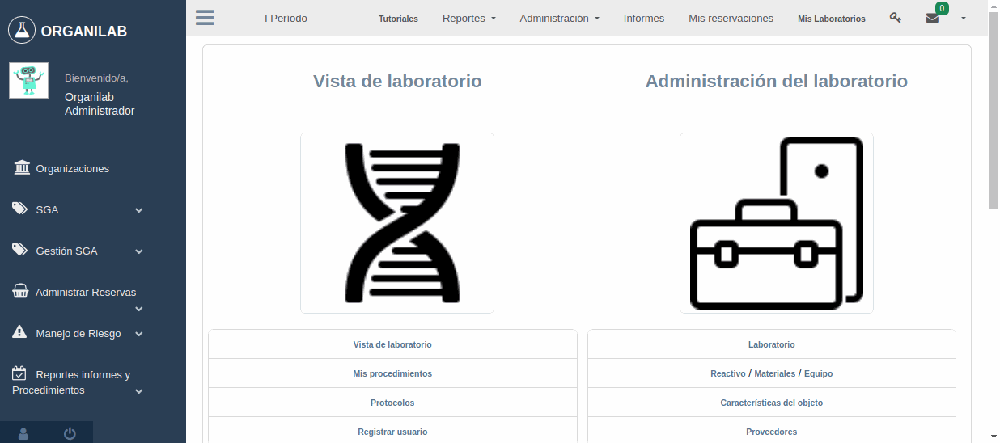

Vista de laboratorio
*****************************

Árbol relacional de elementos en un laboratorio
=======================================================

El primer elemento en la lista serán las salas de laboratorio, el segundo son sus muebles y el tercero son sus estantes.

Los íconos QR en cada uno de estos elementos contienen un enlace que redirecciona a la vista y posición en la cual este
se ubica, en cuanto al ícono de PDF en el mueble, este redirecciona a la vista del reporte de objetos por mueble.

Creación de objeto en el estante
=====================================

De tipo reactivo
---------------------

Los objetos de tipo reactivo son los únicos que el formulario solicitará un contenedor en su información, existen 2
opciones de contenedor que se mostrarán en los siguientes gifs a continuación.

1. Reactivo con contenedor clonado
^^^^^^^^^^^^^^^^^^^^^^^^^^^^^^^^^^^^^^^^^^

2. Reactivo con contenedor seleccionado
^^^^^^^^^^^^^^^^^^^^^^^^^^^^^^^^^^^^^^^^^^^^

De tipo material
---------------------

El material son todos los elementos que pueden contener sustancias, no es requisito indispensable que estos objetos
sean contenedores definitivos pueden ser elementos que se utilicen para realizar pruebas como son las jeringas de un
solo uso que son desechables o las buretas que también son recipientes (Utilizados de manera breve) y que no equivalen
a un elemento de mayor capacidad de almacenaje por mayor tiempo como lo es un galón.

De tipo equipo
---------------------

Los equipos en laboratorio son todos los elementos que se utilizan para facilitar las prácticas y que son parte de un
ambiente de laboratorio como lo son las balanzas, el microscopio y embudos.

Explicación de campos exclusivos a objetos de estantería de tipo equipo:

*   **Proveedor:** El listado de proveedores disponibles para seleccionar serán los vinculados al equipo base escogido.
*   **Roles autorizados para el uso del equipo:** Los roles a seleccionar serán los vinculados a la organización.
*   **Contracto de mantenimiento:** El documento puede ser en cualquier formato *PDF*, *Doc*, *Ods* o imagen.

..  note::
    La cantidad del objeto creado será de **1**, por defecto.

Ver los contenedores del estante
======================================

La lista de contenedores por estante muestra todos los contenedores en uso y también los que se encuentran disponibles
dentro de ese estante.

Transferencia de objetos de estante al laboratorio (Importación)
=======================================================================

Las tranferencias son procesos que consisten en un laboratorio que envía un objeto en estante y otro que recibe, los
objetos pueden ser de cualquier tipo como reactivos, materiales o equipos.

Aprobación de la transferencia
-----------------------------------------------

Para las opciones 3 y 4 si el objeto es de tipo reactivo es necesario que el mismo tenga un contenedor, de lo
contrario se indicará que el objeto no tiene contenedor relacionado y no se podrá realizar la transferencia.

Además también es requisito que el estante que recibirá el objeto tenga las características necesarias como capacidad
de almacenaje ilimitado o disponible y también que la unidad de medida del objeto a recibir sea equivalente a la del
estante o que el estante no tenga unidad de medida, lo que quiere decir que es un estante que almacena múltiples objetos
de distintas unidades de medida.

1. Objeto en estante con contenedor nuevo basado en el seleccionado
^^^^^^^^^^^^^^^^^^^^^^^^^^^^^^^^^^^^^^^^^^^^^^^^^^^^^^^^^^^^^^^^^^^^^^^^^^^^^^^^^^^^

2. Objeto en estante con contenedor seleccionado
^^^^^^^^^^^^^^^^^^^^^^^^^^^^^^^^^^^^^^^^^^^^^^^^^^^^^^^^^^^^^^^^^^^^^^^^^^^^^^^^^^^^

3. Objeto en estante con movimiento de contenedor desde el laboratorio fuente (Tranferencia de reactivo con su contenedor)
^^^^^^^^^^^^^^^^^^^^^^^^^^^^^^^^^^^^^^^^^^^^^^^^^^^^^^^^^^^^^^^^^^^^^^^^^^^^^^^^^^^^^^^^^^^^^^^^^^^^^^^^^^^^^^^^^^^^^^^^^^^^^^^^^^^^^^^

4. Objeto en estante con nuevo contenedor actual en el laboratorio fuente (Réplica del contenedor en el que estaba)
^^^^^^^^^^^^^^^^^^^^^^^^^^^^^^^^^^^^^^^^^^^^^^^^^^^^^^^^^^^^^^^^^^^^^^^^^^^^^^^^^^^^^^^^^^^^^^^^^^^^^^^^^^^^^^^^^^^^^^^^^^^^^^

Rechazo de la transferencia
-----------------------------------------------

Acciones del objeto en el estante
======================================

Ver detalle del objeto en el estante
-----------------------------------------------

En el detalle del objeto en el estante se puede visualizar la información general de este y descargar su QR con enlace
a este mismo.

Reservar un objeto en el estante
-----------------------------------------------

Las reservas de un objeto en el estante permiten realizar la solicitud de uso de un elemento del laboratorio para uso de
procedimientos estudiantiles u otros fines.

Incrementar un objeto en el estante
-----------------------------------------------

Con el fin de incrementar el stock de un elemento en laboratorio cuando es requerido.

Transferir un objeto en el estante a otro laboratorio (Exportación)
--------------------------------------------------------------------------

La transferencia de objetos a otro laboratorio implica un laboratorio que envía (Labaoratorio actual) y otro que recibe,
se pueden tranferir cualquier tipo de objeto y de ser necesario este puede marcarse como desecho.

Transferir un objeto en el estante a otro laboratorio
--------------------------------------------------------------------------

Transferir un objeto en el estante como desecho a otro laboratorio
--------------------------------------------------------------------------

Decrementar un objeto en el estante
------------------------------------------

Sustracción de un objeto en el estante debido a acondicionamiento de la sala de laboratorio, solicitudes, reservas, etc.

Actualizar contenedor del objeto en el estante (Reactivo)
-------------------------------------------------------------------------

El contenedor del objeto en el estante puede ser actualizado en caso de ser necesario, un ejemplo de esto es cuando la
cantidad de un reactivo supera la capacidad de almacenaje de su contenedor actual y necesita ser trasladado a otro.

1. Opciones de contenedor --> Crear nuevo basado en el seleccionado
^^^^^^^^^^^^^^^^^^^^^^^^^^^^^^^^^^^^^^^^^^^^^^^^^^^^^^^^^^^^^^^^^^^^^^^^^^^^

2. Opciones de contenedor --> Usar seleccionado
^^^^^^^^^^^^^^^^^^^^^^^^^^^^^^^^^^^^^^^^^^^^^^^^^^^^^^^^^^^^^^^^^^^^^^^^^^^^

Mover un objeto en el estante a otro estante (Dentro del mismo laboratorio)
---------------------------------------------------------------------------------------------

Existen 4 opciones de contenedor a la hora de mover un objeto en el estante, a continuación se ilustran las siguientes:

Nota: Para las opciones 3 y 4 si el objeto es de tipo reactivo es necesario que el mismo tenga un contenedor, de lo
contrario se indicará que el objeto no tiene contenedor relacionado y no se podrá realizar el movimiento. Si te interesa
como asignar un contenedor puedes elegir la opción 1 ó 2 ó sino lee la sección *Actualizar contenedor del objeto en el estante (Reactivo)*
para administrar el contenedor de los objetos en estante.

1. Opciones de contenedor --> Crear nuevo basado en el seleccionado
^^^^^^^^^^^^^^^^^^^^^^^^^^^^^^^^^^^^^^^^^^^^^^^^^^^^^^^^^^^^^^^^^^^^^^^^^^^^

2. Opciones de contenedor --> Usar seleccionado
^^^^^^^^^^^^^^^^^^^^^^^^^^^^^^^^^^^^^^^^^^^^^^^^^^^^^^^^^^^^^^^^^^^^^^^^^^^^

3. Opciones de contenedor --> Mover el contenedor desde el laboratorio fuente
^^^^^^^^^^^^^^^^^^^^^^^^^^^^^^^^^^^^^^^^^^^^^^^^^^^^^^^^^^^^^^^^^^^^^^^^^^^^^^^^^^^^^^^^^^^^

4. Opciones de contenedor --> Crear uno nuevo a partir del contenedor actual en el laboratorio fuente
^^^^^^^^^^^^^^^^^^^^^^^^^^^^^^^^^^^^^^^^^^^^^^^^^^^^^^^^^^^^^^^^^^^^^^^^^^^^^^^^^^^^^^^^^^^^^^^^^^^^^^^^^^^^^^^^^^^^^^^

Ver la bitácora de un objeto en el estante
--------------------------------------------------------

La bitácora es una pieza fundamental porque contiene las observaciones sobre los distintos cambios que pudo haber
sufrido este a lo largo de su existencia dentro del laboratorio, como cambios de estado, incrementos, decrementos, etc.

Descargar PDF de la información de un objeto en el estante
---------------------------------------------------------------------

El PDF del objeto en el estante permite apreciar toda la información relevante a este, como lo es modelo, placa, serie,
tipo, características, ubicación dentro del estante y mucho más.

Eliminar un objeto en el estante
---------------------------------------------------------------------

El siguiente gif muestra como se realiza la eliminación de un reactivo, aplica el mismo proceso para materiales y equipos.

1. Eliminar reactivo
^^^^^^^^^^^^^^^^^^^^^^^^^^^^^^^^^^^^^^^^^^

2. Eliminar reactivo y su contenedor (Solo los objetos de tipo reactivo tienen contenedor)
^^^^^^^^^^^^^^^^^^^^^^^^^^^^^^^^^^^^^^^^^^^^^^^^^^^^^^^^^^^^^^^^^^^^^^^^^^^^^^^^^^^^^^^^^^^^^^^^^^

Búsqueda de elementos
=========================================================

La sección de búsqueda presenta las siguientes características:

Permisos de usuario
--------------------------

    Verifica permisos de usuario en el laboratorio y la organización. En caso de que el usuario en sesión
    no tenga permisos en el laboratorio y organización actual, este será redireccionado a la página de inicio
    de sesión como permiso denegado 403.

    .. image:: ../_static/user_without_permissions.png

Secciones del campo de búsqueda
--------------------------------------

    .. image:: ../_static/search_input.png

    Permite filtrar y seleccionar etiquetas de laboratorio como salas de laboratorio, muebles, estantes, objetos
    en el estante y objetos.

    .. image:: ../_static/search.png

Botones de acción
----------------------

    Estos botones están incluidos dentro de la funcionalidad de búsqueda.

    .. image:: ../_static/collapse_button.png
    .. image:: ../_static/search_action_buttons.png

 - ``Botón de colapso (Primer botón --> ícono de comprimir)``: Colapsa el árbol relacional de elementos.
    .. image:: ../_static/collapse_button.png

 - ``Botón para remover todas las etiquetas (Segundo botón --> ícono de bote de basura)``: Remueve todas las etiquetas
    dentro del campo de búsqueda y reinicia los elementos de búsqueda (árbol relacional).
    .. image:: ../_static/remove_all_tags.png

 - ``Botón de información del color (Tercer botón --> ícono de información)``: Brinda información acerca de las
    etiquetas de elementos de filtro dentro del laboratorio con su respectivo color.

    .. image:: ../_static/color_info.png

Tipo de búsqueda por elemento
------------------------------------

Buscar por sala de laboratorio
^^^^^^^^^^^^^^^^^^^^^^^^^^^^^^^^^^^^^^^

    Permite encontrar y seleccionar la sala respectiva dentro del laboratorio.

   .. image:: ../_static/search_labroom.png

Buscar por mueble
^^^^^^^^^^^^^^^^^^^^^^^^^^^^^^^^

    Permite encontrar y seleccionar el mueble respectivo dentro del laboratorio. Además su antecesor
    (La sala de laboratorio que lo contiene) también será seleccionado en el árbol de relación.

    .. image:: ../_static/search_furniture.png

Buscar por estante
^^^^^^^^^^^^^^^^^^^^^^^^^^^^^^^^

    It allows to relate and find a specific shelf inside a laboratory. Shelf element and its
    predecessors(furniture, laboratory room) will be selected and shelf object table is going to be update by this shelf.

    Permite encontrar y seleccionar el estante respectivo dentro del laboratorio. Además sus antecesores
    (La sala de laboratorio y su mueble que lo contienen) también serán seleccionados en el árbol de relación.
    La tabla que se ubica en la parte inferior de la vista de laboratorio que contiene los objetos en el estante también
    será actualizada una vez se haya procedido con la búsqueda efectiva del estante por medio del uso de las etiquetas.

    .. image:: ../_static/search_shelf.png

Buscar por objeto en el estante
^^^^^^^^^^^^^^^^^^^^^^^^^^^^^^^^^^^^^^^^

    Permite encontrar y seleccionar el objeto en el estante respectivo dentro del laboratorio. Además sus antecesores
    (La sala de laboratorio, su mueble y su estante que lo contienen) también serán seleccionados en el árbol de relación.
    La tabla que se ubica en la parte inferior de la vista de laboratorio que contiene los objetos en el estante también
    será actualizada por la selección del estante y en la tabla se agregará en el campo de búsqueda "pk=ID DEL OBJETO EN EL ESTANTE",
    este ID corresponderá al elemento de la etiqueta seleccionado.

    .. image:: ../_static/search_shelfobject.png

Buscar por objeto
^^^^^^^^^^^^^^^^^^^^^^^^^^^^^^^^^^^

    Permite encontrar coincidencias con objetos ubicados en distintos estantes, muebles y salas.
    La búsqueda de objetos solo incluirá los que están registrados en stock por lo que si se ingresa
    el nombre de uno que no hay a disposición en el laboratorio el resultado de tags no mostrará resultados.
    El primer elemento del resultado será el seleccionado y filtrado en la tabla de objetos en el estante.

   .. image:: ../_static/search_object1.png
   .. image:: ../_static/search_object2.png

Buscar por enlace
^^^^^^^^^^^^^^^^^^^^^^^^^^^^^^^^^^^

    Esta función obtiene los siguientes parámetros: [sala de laboratorio, mueble, estante, objeto en el estante],
    los cuales no son parámetros requeridos en esta vista, solamente representan una búsqueda alternativa y opcional.
    Uno de los requisitos es que exista relación entre los elementos que el enlace incluya.

    Un ejemplo de esto es la siguiente dirección de enlace ``{{domain}}/lab/1/1/rooms/?labroom=1&furniture=1`` donde
    ``furniture 1`` pertenece a ``labroom 1``. Además cualquier elemento declarado en el enlace debe encontrarse dentro
    del laboratorio.

   .. image:: ../_static/search_by_url.png

Clasificación de la prioridad de búsqueda
----------------------------------------------

 Los elementos dentro de la vista de laboratorio serán clasificados bajo el siguiente orden de prioridad:

 - 1. ``Objeto``
 - 2. ``Objeto en el estante``
 - 3. ``Estante``
 - 4. ``Mueble``
 - 5. ``Sala de laboratorio``

 El elemento objeto será el de mayor prioridad mientras que la sala de laboratorio tendrá la menor prioridad en esta clasificación.

 Un ejemplo es una búsqueda con etiquetas multiples como las siguientes:

 ``Inventory Room (Laboratory Room)``  ``Nitrogen(Object)``

 El buscador encontrará ambos elementos, pero el segundo al ser un elemento de tipo objeto tendrá mayor prioridad
 sobre la búsqueda. En la siguiente imagen adjuntada se puede apreciar que el tag de ``Inventory Room`` fue
 seleccionado y su resultado fue filtrado por la sala de laboratorio y oculta los otros, pero no obstante la segunda
 etiqueta ``Nitrogen`` busca un objeto en específico, el cual fue encontrado dentro de ``Inventory Room`` y ``Test Room``
 por defecto este elemento será seleccionado como un antecesor.

    .. image:: ../_static/priority_search.png

Edición de Objectos de estantería tipo equipo
================================================

Bitácora de mantenimientos
----------------------------------------------
Este acción registrara los mantenimientos realizados al equipo con los siguientes datos:
*   **Fecha de mantenimiento**
*   **Proveedor:** Los proveedores que se pueden registrar son los asociados a la organización
*   **Observaciones**

Crear mantenimiento
^^^^^^^^^^^^^^^^^^^^^^

Editar mantenimiento
^^^^^^^^^^^^^^^^^^^^^^^^^^^^^^^^^^^

Buscar mantenimientos
^^^^^^^^^^^^^^^^^^^^^^^^^^^^^^^^^^^
Las bitácoras de mantenimiento se puede filtrar por la persona que los registro que el **Validador**, la fecha que
permite efectuar la busqueda mediante rangos de fechas, proveedor y ultimo mantenimiento.

Eliminar mantenimiento
^^^^^^^^^^^^^^^^^^^^^^^^^^^^^^^^^^^

Capacitaciones
------------------

Crear capacitación
^^^^^^^^^^^^^^^^^^^^^^^^^^^^^^^^^^^

Editar capacitación
^^^^^^^^^^^^^^^^^^^^^^^^^^^^^^^^^^^

Buscar capacitación
^^^^^^^^^^^^^^^^^^^^^^^^^^^^^^^^^^^

Eliminar capacitación
^^^^^^^^^^^^^^^^^^^^^^^^^^^^^^^^^^^

Garantías
------------
Esta accion hace referencia a las garantía que posee el equipo:

Crear garantía
^^^^^^^^^^^^^^^^^^^^^^^^^^^^^^^^^^^

Editar garantía
^^^^^^^^^^^^^^^^^^^^^^^^^^^^^^^^^^^

Buscar garantías
^^^^^^^^^^^^^^^^^^^^^^^^^^^^^^^^^^^

.. image:: ../_static/gif/search_user_shelfobject_equipment_guarantee.gif
   :height: 380
   :width: 720

Eliminar garantía
^^^^^^^^^^^^^^^^^^^^^^^^^^^^^^^^^^^

