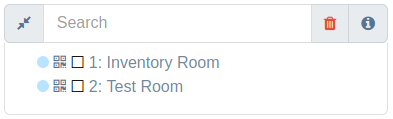

Search elements in a laboratory view
####################

============================================
SearchLabView API
============================================

SearchLabView is a generic view set with following features:

---------------------
 User Permissions
---------------------

 Check user permissions on laboratory and organization. In case user in session doesn't have
 permissions on current laboratory and organization will be redirected to login page as a permission denied 403.

 .. image:: ./_static/user_without_permissions.png

---------------------
 Input Search Parts
---------------------

Input Search
--------------------

It allows to filter and select laboratory tags like laboratory rooms, furnitures, shelves, shelf objects and objects.

Action Buttons
--------------------

 These buttons are included inside search functionality.

 .. image:: ./_static/collapse_button.png
 .. image:: ./_static/search_action_buttons.png

 - ``Collapse button(First button(compress icon))``: It collapses the relational tree elements.
 .. image:: ./_static/collapse_button.png

 - ``Remove all tags button(Second button(trash icon))``: It removes all tags inside to input search and restart search elements(relational tree).
 .. image:: ./_static/remove_all_tags.png

 - ``Color information button hover(Third button(info icon))``: It gives to color information about filter and selection tags.
 .. image:: ./_static/color_info.png

---------------------
 Type Search By Element
---------------------

Search By Laboratory Room
--------------------
   It allows to relate and find a specific laboratory room inside a laboratory. Laboratory room element will be selected.

   .. image:: ./_static/search_labroom.png

Search By Furniture
--------------------
   It allows to relate and find a specific furniture inside a laboratory. Furniture element and its
   predecessor(laboratory room) will be selected.

   .. image:: ./_static/search_furniture.png

Search By Shelf
--------------------
   It allows to relate and find a specific shelf inside a laboratory. Shelf element and its
   predecessors(furniture, laboratory room) will be selected and shelf object table is going to be update by this shelf.

   .. image:: ./_static/search_shelf.png

Search By Shelf Object
--------------------
   It allows to relate and find a specific shelf object inside a laboratory. Shelf Object element and its
   predecessors(shelf, furniture, laboratory room) will be selected and shelf object table is going to be update by this
   shelf object pk, where pk=11 represents a filter inside this table.

   .. image:: ./_static/search_shelfobject.png

Search By Object
--------------------
   It allows to relate and find and coincidences about object name inside a shelf object table.
   The accepted objects just will be used objects by this laboratory in its stock. Just the first shelf related to this
   object is going to be selected.

   .. image:: ./_static/search_object1.png
   .. image:: ./_static/search_object2.png

Search By Url
--------------------
   This get request method can be include the following parameters: [labroom, furniture, shelf, shelfobject]. They are not
   required parameters in this view. It just an optional search. Correlation between more than one element is required.

   An example the following url address ``{{domain}}/lab/1/1/rooms/?labroom=1&furniture=1`` where ``furniture 1`` needs
   to belong to ``labroom 1``. Also any element declared in url should be inside to current laboratory.

   .. image:: ./_static/search_by_url.png

============================================
Search Priority Classification
============================================

 Elements inside laboratory view will be classified by following priority:

 - 1. ``Object``
 - 2. ``Shelf Object``
 - 3. ``Shelf``
 - 4. ``Furniture``
 - 5. ``Laboratory Room``

 Object element will have the greater priority while laboratory room element will have the lower priority in this classification.

 An example is a search with multiple tags like:

 ``Inventory Room(Laboratory Room)``  ``Nitrogen(Object)``

 Logical search is going to find both elements but the second element(object) have priority. In the following picture
 ``Inventory Room`` tag was selected and its result is filtered by this laboratory room and hide the other ones
 but however the second tag ``Nitrogen`` search a specific object and it was found inside ``Inventory Room`` and
 ``Test Room`` for default this element is going to be selected as a predecessor.

 .. image:: ./_static/priority_search.png

