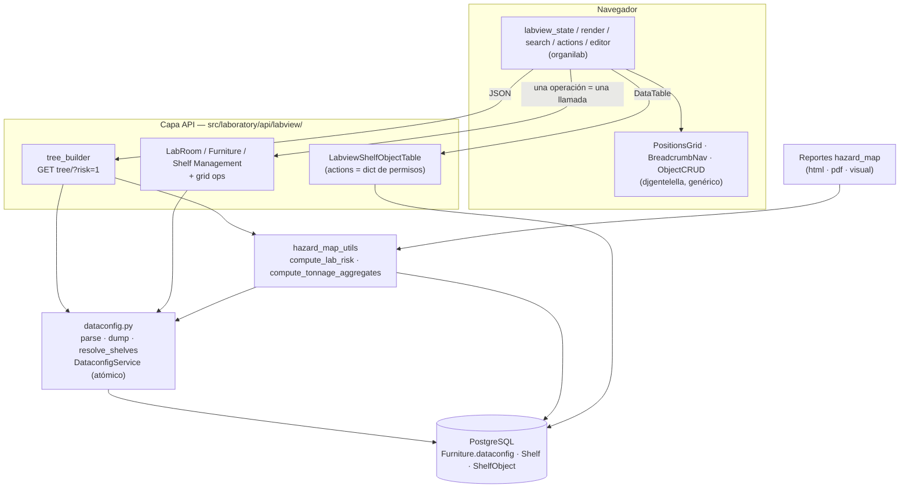

# Arquitectura del labview — mapa digital del laboratorio

Documento de **arquitectura**: explica las capas del subproyecto labview y **por qué** son
así. El plan ejecutable (fases, archivos, orden) está en
[`14_ETAPA_LABVIEW.md`](14_ETAPA_LABVIEW.md) y el prototipo visual de la pantalla en
[`14_labview_prototipo.svg`](14_labview_prototipo.svg).

## El problema que resuelve

El laboratorio se representa digitalmente como una jerarquía física —
**laboratorio → sala → mueble → estante → objeto** — donde el mueble es una **cuadrícula**
(filas × columnas) que intenta parecerse a la ubicación real. Esa representación no es
decorativa: **alimenta la medición de riesgo** (qué sustancias conviven cerca, cuánta masa
hay por zona, qué incompatibilidades existen).

La implementación heredada tenía tres problemas de fondo:

1. **El layout no tenía dueño.** `Furniture.dataconfig` es un `TextField` con una matriz
   serializada, leído por 5 parsers distintos y escrito por 3 serializadores incompatibles
   (uno de ellos en JavaScript, concatenando strings desde el DOM). Nadie validaba el
   formato más allá de una expresión regular.
2. **El estado vivía en el navegador.** El editor de la cuadrícula construía toda la
   estructura en el DOM y la volcaba a un campo oculto al guardar. Los índices de fila y
   columna que viajaban en las URLs eran posicionales del momento: añadir una fila antes de
   guardar los desfasaba respecto a la base de datos.
3. **El servidor devolvía HTML por AJAX.** Fragmentos parciales que el cliente insertaba en
   divs concretos (`django_ajax`), lo que acopla el servidor a la maquetación y hace
   imposible reutilizar esos datos desde otra pantalla — por ejemplo, desde el mapa de
   peligros, que terminó re-implementando su propio parser de `dataconfig`.

La arquitectura nueva ataca esos tres puntos: **un dueño del formato, el estado en el
servidor, y datos (no HTML) en el cable.**

## Vista general

## Capa 1 — `dataconfig.py`: un solo dueño del formato

`src/laboratory/dataconfig.py` es el **único** módulo que sabe cómo se codifica el layout de
un mueble. Se divide en dos mitades:

- **Funciones puras** (`parse`, `dump`, `resolve_shelves`, `get_position`, `iter_shelf_pks`,
  `dimensions`). `parse` es deliberadamente **tolerante** — acepta los formatos históricos
  (JSON, CSV `"1,2"`, enteros sueltos, el `repr` de Python con comillas simples) porque la
  base de datos ya contiene todos ellos. `dump` es deliberadamente **estricto**: siempre
  `json.dumps` de una matriz de enteros. Esa asimetría (leer flexible, escribir canónico) es
  lo que permite converger el formato sin una migración bloqueante.
- **`DataconfigService`**: el servicio de mutación. Cada operación
  (`place_shelf`, `move_shelf`, `remove_shelf`, `add_row`, `remove_row`, `add_col`,
  `remove_col`) abre una transacción con `select_for_update` sobre el mueble, parsea, muta y
  vuelve a escribir. Dos usuarios editando el mismo mueble se serializan en la base de
  datos, no compiten por sobrescribir un string completo.

**Por qué `dataconfig` sigue siendo `TextField` y no se normaliza a columnas.** Migrar la
posición a `Shelf.row`/`Shelf.col` obligaría a tocar los cinco parsers, los tres escritores,
los importadores y el mapa de peligros en un solo cambio, con datos legados de formato
inconsistente. Encapsular primero es más barato y reversible: una vez que **solo** este
módulo escribe, pasar a `JSONField` (o a columnas) es un cambio local con una migración
trivial. Queda anotado como pendiente, no como deuda oculta.

**Regla de la capa:** ningún otro módulo vuelve a hacer `json.loads`, `split(",")` o
`re.findall` sobre `dataconfig`. Los métodos de `Furniture` conservan su nombre público pero
delegan aquí, de modo que los llamadores existentes no se enteran.

## Capa 2 — API: datos, no fragmentos

Todo lo que el cliente necesita llega como JSON. Tres piezas:

**CRUDs por nivel.** `LabRoomManagement`, `FurnitureManagement` y `ShelfManagement` se
construyen sobre `BaseInlineObjectManagement` de la biblioteca: cada uno declara su modelo
padre y acota el queryset a ese padre, que se resuelve **desde la URL** (`org_pk`, `lab_pk`)
y nunca desde el cuerpo de la petición. Es el mismo patrón ya validado en
`academic/ProcedureStepInlineManagement`. El hook `get_parent_queryset()` es donde vive la
autorización multi-tenant: sin él, cualquier usuario con permiso sobre el modelo podría
nombrar el pk de otro laboratorio.

**Operaciones de cuadrícula, una a una.** Crear un estante en una celda, moverlo, quitarlo,
añadir o eliminar una fila o columna: cada una es una llamada que muta `dataconfig` en el
servidor y **devuelve el estado nuevo completo** (`{grid, shelves}`). Consecuencias
deliberadas:

- Los índices de fila y columna dejan de ser un dato del DOM: la posición nace atómica junto
  al estante (`create` exige `row`/`col` y llama a `place_shelf` en la misma transacción) y
  después se opera **siempre por `shelf_pk`**.
- Las operaciones destructivas pueden negarse con motivo: eliminar una fila que contiene
  estantes, o un estante que contiene objetos, responde `409 Conflict` en vez de corromper
  el layout.
- No hay "guardar": no existe un estado intermedio que se pueda perder al cerrar la pestaña.

**El árbol.** `GET .../api/labview/tree/?risk=1` devuelve el mapa completo del laboratorio en
una sola respuesta: salas, muebles con su cuadrícula real, estantes con nombre, tipo,
posición, capacidad, porcentaje de ocupación y descarte, más conteos agregados y —cuando se
pide— el color de riesgo. Se construye en 3-4 consultas (salas; muebles; estantes por
`pk__in` de todos los `dataconfig` parseados; agregados de objetos por `values`/`annotate`),
frente al N+1 por celda que hacía el mapa de peligros.

Que el riesgo sea **opcional por parámetro** mantiene barata la navegación normal y hace del
overlay una decisión explícita del usuario.

## Capa 3 — Riesgo: un solo constructor

`hazard_map_utils` deja de ser una isla con su propio parser. Se refactoriza para exponer
`compute_lab_risk(laboratory)` — colores por estante, códigos H, alertas y agregados — que
consumen **tanto los reportes de mapa de peligros como el endpoint de árbol**. El motor de
compatibilidad (`compatibility_utils`) y la semántica de color (rojo/ámbar/verde por
incompatibilidad entre estantes de la misma sala) no cambian.

El objetivo es que **la pantalla y el reporte no puedan divergir**: si el mapa dice que un
estante es rojo, el reporte dice lo mismo, porque es el mismo cálculo. `compute_lab_tonnage`
se generaliza a agregados por laboratorio, sala y mueble, que es lo que faltaba para razonar
sobre riesgo a nivel de zona y no solo del laboratorio entero.

## Capa 4 — Widgets genéricos (djgentelella)

Dos componentes se aportan a la biblioteca porque **no saben nada de organilab**:

- **`PositionsGrid`** — una matriz de filas × columnas con items opacos. Recibe `data`
  (dimensiones y qué ids hay en cada celda), un catálogo `items`, y una función
  `renderItem` con la que el proyecto anfitrión decide el aspecto. En modo edición recibe
  `handlers` para las siete operaciones.
- **`BreadcrumbNav`** — la ruta jerárquica navegable que rellena el bloque `breadcrumbs`
  vacío del tema.

**El contrato clave es `handler → Promise → re-render`:** el widget nunca mantiene ni
serializa un estado propio; invoca el handler, espera el estado nuevo que devuelve el
servidor y se repinta con él. Es exactamente lo contrario del editor anterior (que
reconstruía el layout leyendo el DOM) y es lo que hace que "persistencia por operación" sea
la única forma posible de usarlo. Un widget que no puede acumular estado local no puede
divergir de la base de datos.

Ambos son **responsive de origen** (CSS grid con scroll contenido, targets táctiles, mover
por toque en vez de arrastrar, breadcrumb que colapsa niveles), porque el laboratorio se
consulta también desde tablet o teléfono, de pie frente a un mueble.

## Capa 5 — Permisos: mostrar y autorizar son dos cosas

La regla es que **la interfaz se muestre según lo que el usuario puede hacer**, sin que eso
debilite el control real. Por eso la decisión se toma dos veces, en el mismo sitio:

- **Para mostrar**, el servidor envía capacidades en el payload: un bloque `permissions` a
  nivel de laboratorio en la respuesta del árbol, flags por nodo cuando dependen del objeto,
  y —por fila de la tabla— un diccionario `{accion: bool}` que combina el permiso con el
  estado del objeto (tipo de reactivo o equipo, si es caja, si tiene contenedor). El cliente
  **no deduce** permisos: pinta lo que el payload autoriza.
- **Para autorizar**, cada endpoint vuelve a exigir su permiso mediante el diccionario
  `perms` por acción y `AllPermissionByAction` (una acción no mapeada responde 403). Un
  cliente manipulado no gana nada saltándose la primera capa.

Este diseño sustituye al HTML de acciones renderizado por el servidor (124 líneas de botones
condicionados) por datos, **conservando las reglas exactamente**: la traducción es 1:1 y la
prueba de la matriz de permisos existe para demostrarlo, no para reinterpretarlas.

El corolario práctico es la **degradación coherente**: sin permiso de cambiar mobiliario no
aparece el modo edición ni sus handlers; sin permiso de añadir estantes la celda vacía no
ofrece crear; sin permiso de ver objetos la tabla ni se pide. Nunca se ofrece una acción que
el servidor va a rechazar.

## Capa 6 — La UI como consumidor

La pantalla nueva es deliberadamente delgada: una vista de plantilla que resuelve el
deep-link en el servidor y entrega un estado inicial, y JavaScript organizado por
responsabilidad — estado y URL, render del mapa, búsqueda, acciones, edición.

Tres decisiones que la definen:

- **Reutiliza lo que ya es JSON.** Los modales de acciones de objeto y su motor
  (`base_modal_management.js`) llevan tiempo funcionando contra la API: no se reescriben. La
  tabla usa `ObjectCRUD` de la biblioteca con el mismo patrón que la pantalla de equipos.
- **La búsqueda navega en vez de ocultar.** El endpoint de búsqueda ya devuelve la cadena
  jerárquica completa de cada coincidencia; con eso el mapa expande la sala, desplaza hasta
  el mueble, resalta el estante y filtra la tabla — en lugar de esconder nodos de un árbol
  ya renderizado.
- **El deep-link es un contrato, no un detalle.** Los QR impresos y pegados en los muebles y
  los enlaces del mapa de peligros apuntan a `?labroom=&furniture=&shelf=&shelfobject=`. La
  vista nueva lo entiende y lo mantiene en la barra de direcciones al navegar, y cuando la
  vista vieja se retire seguirá respondiendo por redirección conservando esos parámetros.

### QR, reportes y etiquetas: funciones de datos, no de plantilla

Cada nivel del mapa tiene hoy su **QR** (sala, mueble y estante), el mueble tiene su
**reporte PDF**, y cada objeto tiene su QR, su reporte, su bitácora, sus **etiquetas y
recipientes** de SGA y —si es equipo— su mantenimiento. Hoy todo eso lo decide una
plantilla; en el diseño nuevo son datos:

- El **enlace directo y el QR de cada nodo** viajan en la respuesta del árbol, de modo que
  el mapa pueda ofrecerlos sin consultar nada más.
- El **QR del objeto** ya lo devuelve la API de detalle en base64: el modal se rinde en
  cliente con `BaseDetailModal` en vez de recibir HTML.
- Las **etiquetas** siguen colgando de sus endpoints de SGA, y el botón solo aparece donde
  aparecía: reactivos, con `sga.view_recipientsize`.
- Las acciones que **abren otra página** (bitácora, mantenimiento, reporte) se declaran con
  `link: true`, la capacidad que la biblioteca ganó en la etapa 10 justo para esto.

La consecuencia buscada es que ninguna de estas funciones dependa ya de dónde esté
renderizada: el mismo dato sirve al mapa, al móvil y a quien consulte la API.

## Reparto de responsabilidades

| | djgentelella (genérico) | organilab (dominio) |
|---|---|---|
| Widgets | `PositionsGrid`, `BreadcrumbNav`, `ObjectCRUD`, modales | Configuración, `renderItem`, textos |
| API base | `BaseInlineObjectManagement`, `AllPermissionByAction`, formato DataTable | Viewsets por nivel, árbol, operaciones de cuadrícula |
| Autorización | Mecanismo (`perms` por acción) | Política (multi-tenant org/lab, capacidades en el payload) |
| Datos | — | `dataconfig.py`, riesgo, agregados |

La regla del roadmap se mantiene: la biblioteca no sabe que existen laboratorios; organilab
la configura y la subclasea.

## Qué queda fuera (y por qué)

- **Incompatibilidad dentro del mismo estante**: el cálculo actual compara estantes entre sí
  y se salta el propio. Es un hueco real del modelo de riesgo, pero es un cambio de política
  de cálculo, no de arquitectura.
- **Ubicación estructurada en IPER**: hoy es texto libre. Con estas APIs pasa a ser
  ejecutable, y se aborda como proyecto propio.
- **Mover un estante entre muebles**: tampoco existe hoy; la arquitectura lo permite
  (sería una operación más del servicio), pero no se añade funcionalidad nueva en una etapa
  de migración.
